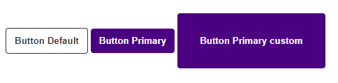
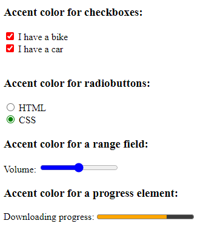

# New-Features-of-Css3

## Tính năng Subgrid

Subgrid là một tính năng của CSS Grid Layout, giúp kế thừa cấu trúc grid từ phần tử cha vào các phần tử con.

Khi một phần tử con trong grid được định vị với thuộc tính "display: grid" và "grid-template-rows" hoặc "grid-template-columns" được định nghĩa trên phần tử cha, ta có thể sử dụng thuộc tính "display: subgrid" trên phần tử con để kế thừa cấu trúc grid từ phần tử cha.

Khi sử dụng "display: subgrid", phần tử con sẽ sử dụng các giá trị của "grid-template-rows" hoặc "grid-template-columns" từ phần tử cha, thay vì phải định nghĩa lại chúng. Điều này giúp tạo ra một cấu trúc grid liên tục và đồng bộ giữa các phần tử trong grid.

Ví dụ:

```css
.container {
  display: grid;
  grid-template-columns: 1fr 1fr;
  grid-template-rows: 50px 100px;
}

.item {
  display: subgrid;
}
```

Trong ví dụ trên, phần tử cha có lớp "container" được định nghĩa với cấu trúc grid có hai cột và hai hàng. Các phần tử con với lớp "item" sẽ kế thừa cấu trúc grid từ phần tử cha, vì chúng có thuộc tính "display: subgrid".

Tính năng Subgrid rất hữu ích khi muốn tạo ra các cấu trúc grid phức tạp hơn, với các phần tử con có kích thước và định vị phụ thuộc vào cấu trúc grid của phần tử cha. Nó giúp tăng tính linh hoạt và tiết kiệm mã CSS khi làm việc với các cấu trúc grid lồng nhau. 

Tuy nhiên, Subgrid hiện chỉ được hỗ trợ trên một số trình duyệt nhất định như Firefox và Safari, và chưa được hỗ trợ trên các trình duyệt như Chrome và Edge (tính đến thời điểm hiện tại).

Check: <https://caniuse.com/?search=subgrid>


## Tính năng Flexbox Gap

Flexbox Gap là một tính năng trong CSS Flexbox, được sử dụng để thêm khoảng cách (gaps) tự động giữa các phần tử con trong một container flex.

Khi chưa có nó, tùy vào trường hợp chúng ta thường sử dụng margin từ item hoặc jusify-content: space-between

```css
.flex-container {
  display: flex;
  column-gap: 10px;
  row-gap: 10px;
  /* short hand */
  gap: 10px;
}
```

Hiện tại `gap` không hỗ trợ trình duyệt IE

## Tính năng Css Cascade Layer

### Review cơ chế Cascade trong CSS

Cascade (hay còn gọi là "mức độ ưu tiên") là quá trình xác định thứ tự ưu tiên khi áp dụng các quy tắc CSS cho các phần tử trên trang web.

Khi trình duyệt hiển thị một trang web, nó sẽ áp dụng các quy tắc CSS từ nhiều nguồn khác nhau, bao gồm các tệp CSS nội bộ, các tệp CSS bên ngoài và các quy tắc CSS được định nghĩa trực tiếp trên các phần tử HTML. Khi quy tắc CSS xung đột với nhau, cơ chế Cascade sẽ quyết định thứ tự ưu tiên để áp dụng các quy tắc này.

Cơ chế Cascade xác định thứ tự ưu tiên dựa trên các quy tắc sau đây:

1. Quy tắc !important: Nếu một quy tắc được đánh dấu với !important, nó sẽ có mức độ ưu tiên cao nhất và sẽ được áp dụng trước mọi quy tắc khác.

2. Trình tự xuất hiện: Quy tắc CSS sẽ được áp dụng theo thứ tự xuất hiện trong tệp CSS hoặc trên trang HTML. Quy tắc xuất hiện sau sẽ ghi đè lên các quy tắc xuất hiện trước đó cho cùng một phần tử.

3. Quy tắc ưu tiên: Quy tắc có mức độ ưu tiên cao hơn sẽ được áp dụng trước. Các yếu tố ảnh hưởng đến mức độ ưu tiên bao gồm loại chọn, lớp (class), ID, và thẻ HTML. Ví dụ, một quy tắc được áp dụng thông qua một lớp (class) sẽ có mức độ ưu tiên thấp hơn so với một quy tắc được áp dụng thông qua một ID.

4. Quy tắc kế thừa: Một phần tử con sẽ kế thừa các thuộc tính từ phần tử cha, trừ khi được ghi đè bởi các quy tắc khác.

Qua cơ chế Cascade, trình duyệt xác định cách áp dụng các quy tắc CSS cho các phần tử trên trang web, đảm bảo tính nhất quán và kiểm soát được diễn biến của các quy tắc CSS trong quá trình xây dựng giao diện.

### Cascade Layers

CSS Cascade Layers với từ khóa @layer được giới thiệu trong CSS3 vào năm 2009

CSS Cascade Layers là một tính năng CSS cho phép bạn kiểm soát thứ tự mà các thuộc tính CSS được áp dụng cho các phần tử.

Nhưng đến hiện tại ít người sử dụng đến tính năng này.

Link tham khảo: 

- <https://developer.mozilla.org/en-US/docs/Learn/CSS/Building_blocks/Cascade_layers#creating_cascade_layers>

- <https://css-tricks.com/css-cascade-layers/>

- <https://www.lambdatest.com/blog/css-cascade-layers/>

### Cascade Layers với cú pháp @layer

Nói một cách ngắn gọn @layer cho phép bạn tạo các lớp (layer) css, và sắp xếp nó theo thứ tự ưu tiên nào đó.

Cùng tìm hiểu qua một ví dụ:

```css
/* Định nghĩa ra các lớp, và sắp xếp thứ tự ưu tiên từ thấp đến cao */
@layer reset, defaults, components, utilities;


/* import stylesheets từ bên ngoài đến một layer (cú pháp dấu . thể hiện sự lồng nhau) */
@import url('framework.css') layer(components.framework);

/* 
Bạn có thể đặt utilities trước reset
Thứ tự này không được chấp nhận về ưu tiên
*/
@layer utilities {
    .py-5{
        padding-top: 2rem;
        padding-bottom: 2rem;
    }

    .px-5{
        padding-right: 2rem;
        padding-left: 2rem;
    }
}

/* Thêm styles cho layer */
@layer reset {
    * {
        margin: 0;
        padding: 0;
        box-sizing:border-box;
    }
    button{
        appearance: none;
        outline: none;
        border: 0;
    }
}

@layer defaults {
    /* set style mặc định cho một button */
    button{
       padding: 10px 12px;
       background-color: #fff;
       border: 1px solid #333;
       border-radius: 4px;
       color: #333;
       font-weight: bold;
       cursor: pointer;
    }
}


@layer components {
    /* set style biến thể cho một button */
    .btn-primary{
       background-color: indigo;
       border: none;
       color: #fff;
    }
    .btn-primary:hover{
        background-color: rgb(85, 1, 144);
     }
}

/* Các styles nằm ngoài layer sẽ có mức độ ưu tiên cao nhất */
body {
    padding: 30px;
}

```

```html
<body>
    <button>Button Default</button>
    <!-- Khi được add thêm class btn-primary từ components -->
    <button class="btn-primary">Button Primary</button>
    <!-- Khi được add thêm class px-5 py-5 từ utilities -->
    <button class="btn-primary px-5 py-5">Button Primary custom</button>
</body>
```

Kết quả:



Với @layer bạn không cần quan tâm style đó đặt trước sau, hay ở đâu để xét độ ưu tiên.

Với @layer độ ưu tiên của nó được định nghĩa ngay từ đầu.

==> Điều này rất quan trọng khi bạn làm team, làm dự án có nhiều người tham gia. 

==> Giúp tránh xung đột Css

## Tính năng Viewport Units

Trong CSS, các đơn vị viewport (viewport units) được sử dụng để đo và xác định kích thước và vị trí của các phần tử dựa trên kích thước của viewport (khung nhìn) của trình duyệt. Có 4 loại đơn vị viewport units trong CSS, bao gồm:

1. **vw (viewport width)**: Đơn vị vw đại diện cho một phần trăm của chiều rộng của viewport. Ví dụ, giá trị 1vw tương đương với 1/100 chiều rộng của viewport. Nếu viewport có chiều rộng là 1000px, thì 1vw sẽ tương đương với 10px.

1. **vh (viewport height)**: Tương tự như vw, đơn vị vh đại diện cho một phần trăm của chiều cao của viewport. Ví dụ, giá trị 1vh tương đương với 1/100 chiều cao của viewport.

1. **vmin (viewport minimum)**: Đơn vị vmin đại diện cho giá trị nhỏ nhất giữa chiều rộng và chiều cao của viewport. Ví dụ, nếu chiều rộng của viewport là 800px và chiều cao là 600px, thì 1vmin sẽ tương đương với 6px (vì chiều cao là giá trị nhỏ nhất).

1. **vmax (viewport maximum)**: Tương tự như vmin, đơn vị vmax đại diện cho giá trị lớn nhất giữa chiều rộng và chiều cao của viewport. Ví dụ, nếu chiều rộng của viewport là 800px và chiều cao là 600px, thì 1vmax sẽ tương đương với 8px (vì chiều rộng là giá trị lớn nhất).

Các đơn vị viewport units cho phép thiết kế linh hoạt và đáp ứng với kích thước của viewport. Chúng có thể được sử dụng để xác định kích thước, khoảng cách, vị trí và các thuộc tính khác của các phần tử trong CSS. Ví dụ, bạn có thể sử dụng 50vw để đặt chiều rộng của một phần tử là 50% chiều rộng của viewport, hoặc sử dụng 10vh để đặt chiều cao của phần tử là 10% chiều cao của viewport.

Tuy nhiên, cần lưu ý rằng các đơn vị viewport units có thể gây ra hiệu ứng không mong muốn nếu không được sử dụng đúng cách, đặc biệt là trong trường hợp các phần tử con bị tràn ra ngoài viewport. Do đó, cần kiểm tra và thử nghiệm cẩn thận khi sử dụng các đơn vị này để đảm bảo hiển thị đúng và đáng tin cậy trên các thiết bị và kích thước màn hình khác nhau.


## Hàm has() trong Css

Cú pháp:

```css
parent:has(child) {
  /* CSS rules */
}
/* ví dụ cụ thể */
div:has(span) {
  /* CSS rules */
}
```

Xác định xem bên trong phần tử cha (div) có tồn tại phần tử con (span) không.

Nếu có thì áp style này cho phần tử cha (div)

Check tương thích: <https://caniuse.com/?search=%3Ahas>


## @When/@else Css

Check tương thích: <https://caniuse.com/css-when-else>

Có thể hiểu như sau:

Thay ví cách bình thường

```css
@media (min-width: 600px) {
  /* css riêng khi ở màn hình có chiều rộng <= 600px */ 
}
@media (max-width: 599px) {
  /* css riêng khi ở màn hình có chiều rộng > 599px */
}
```

Thì có thể dùng với cú pháp này

```css
@when media(min-width: 600px) {
   /* css riêng khi ở màn hình có chiều rộng <= 600px */ 
}
@else {
  /* còn lại */ 
}
```

Với cú pháp này chúng ta có thể đưa logic xử lí, xét điều kiện phức tạp hơn để áp các styles cho elements

```css
@when media(width >= 400px) and media(pointer: fine) and supports(display: flex) {
  /* A */
} @else supports(caret-color: pink) and supports(background: double-rainbow()) {
  /* B */
} @else {
  /* C */
}
```

==> Các trình duyệt không hỗ trợ tính năng này


## Accent Color Css

Accent color trong CSS là thuộc tính được sử dụng để xác định màu sắc chính (accent color) của một phần tử hoặc giao diện người dùng. Đây thường là màu sắc được sử dụng để làm nổi bật, tạo điểm nhấn và tương tác với người dùng trên trang web hoặc ứng dụng.

Không phải bất cứ input nào củng có thể sử dụng  accent-color CSS, hãy nhớ rằng  accent-color được sử dụng để custom màu sắc cho phần được chọn trong mỗi input, vậy ở đây accent-color chỉ được sử dụng trong các input HTML có tính năng chọn ví dụ như:

- Checkbox input.
- Radio input.
- Range input.
- Progress

Ví dụ:

```html
<h3>Accent color for checkboxes:</h3>
<input type="checkbox" id="vehicle1" name="vehicle1" value="Bike" checked>
<label for="vehicle1"> I have a bike</label><br>
<input type="checkbox" id="vehicle2" name="vehicle2" value="Car" checked>
<label for="vehicle2"> I have a car</label><br><br>

<h3>Accent color for radiobuttons:</h3>
<input type="radio" id="html" name="fav_language" value="HTML">
<label for="html">HTML</label><br>
<input type="radio" id="css" name="fav_language" value="CSS" checked>
<label for="css">CSS</label><br>

<h3>Accent color for a range field:</h3>
<label for="vol">Volume:</label>
<input type="range" id="vol" name="vol" min="0" max="50">

<h3>Accent color for a progress element:</h3>
<label for="file">Downloading progress:</label>
<progress id="file" value="72" max="100"> 72% </progress>
```

```css
input[type=checkbox] {
  accent-color: red;
}

input[type=radio] {
  accent-color: green;
}

input[type=range] {
  accent-color: rgb(0, 0, 255);
}

progress {
  accent-color: hsl(39, 100%, 50%);
}
```

Ra được




## Scroll Timeline

Scroll Timeline là một tính năng CSS mới trong CSS Scroll Snap Module Level 1 và CSS Scroll Snap Module Level 2, được sử dụng để tạo hiệu ứng chuyển động và hoạt hình dựa trên cuộn trang (scrolling). Nó cho phép bạn định nghĩa các keyframe và thuộc tính CSS để áp dụng theo tiến trình cuộn trang.

Scroll Timeline được sử dụng để đồng bộ hóa các hoạt ảnh, chuyển động và các hiệu ứng khác với cuộn trang, giúp tạo ra trải nghiệm trực quan và tương tác hấp dẫn cho người dùng.

Để sử dụng Scroll Timeline, bạn sẽ cần định nghĩa một timeline (thời gian biểu) và các keyframe (khung hình chính) kết hợp với các thuộc tính CSS.

Xem ví dụ: Example-Scroll-timeline

Check tương thích: <https://caniuse.com/css-scroll-timeline>


## Nesting Css

Nesting trong CSS là một kỹ thuật cho phép lồng các quy tắc CSS bên trong nhau để tạo cấu trúc phân cấp và tổ chức mã CSS dễ đọc và hiệu quả hơn. Khi sử dụng nesting, bạn có thể lồng các quy tắc CSS bên trong quy tắc khác dựa trên các yếu tố HTML mà chúng áp dụng.

Để hiểu rõ hơn, dưới đây là một ví dụ card về nesting trong CSS:

Ví dụ: Example-Nesting


Lợi ích của nesting CSS bao gồm:

1. Tổ chức mã dễ đọc: Nesting giúp tạo ra một cấu trúc cây trong CSS, giúp bạn dễ dàng nhận biết các quy tắc áp dụng cho các phần tử con.

1. DRY (Don't Repeat Yourself): Nesting cho phép bạn tái sử dụng các quy tắc CSS chung cho các phần tử con cùng một cách thuận tiện.

1. Scope (Phạm vi): Nesting giúp giới hạn phạm vi của các quy tắc CSS chỉ định cho các phần tử cụ thể. Điều này giúp tránh xung đột và tăng tính tương thích của mã CSS.

Tuy nhiên, khi sử dụng nesting, hãy cẩn thận để không quá lạm dụng và tạo ra quá nhiều lớp lồng nhau sâu, vì điều này có thể làm mã CSS trở nên phức tạp và khó hiểu.