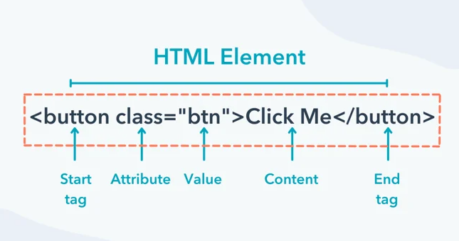
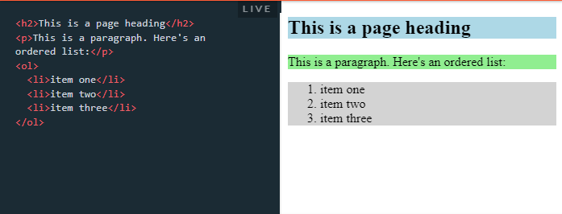
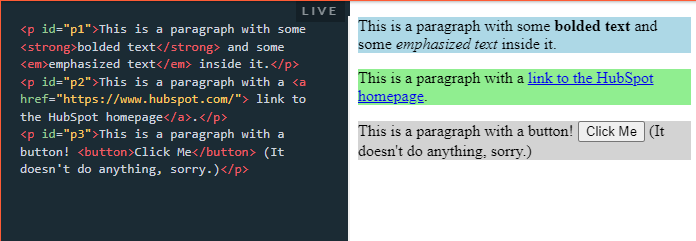
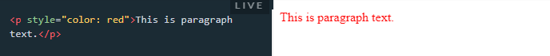

# Session 1 - Intro HTML 5

Một số khái niệm cần nắm

## ⭐ HTML là gì ???

HTML là chữ viết tắt của cụm từ Hyper Text Markup Language ( Ngôn ngữ đánh dấu siêu văn bản) được sử dụng để tạo một trang web, trên một website có thể sẽ chứa nhiều trang và mỗi trang được quy ra là một tài liệu HTML. HTML là một trong những ngôn ngữ quan trọng trong lĩnh vực thiết kế website. HTML đã trở thành một chuẩn mực của Internet do tổ chức World Wide Web Consortium (W3C) duy trì.

HTML không phải là ngôn ngữ lập trình, html là ngôn ngữ đánh dấu (markup language), ngôn ngữ đánh dấu là một nhóm các thẻ đánh dấu (các tag), HTML sử dụng các thẻ này để mô tả trang web.

## ⭐ Static Web Pages ?

Static page là từ chuyên dụng để chỉ các trang web tĩnh. Trang web tĩnh là các trang web sử dụng hoàn toàn ngôn ngữ chính là HTML và sau khi tải trang HTML từ máy chủ, trình duyệt sẽ hiển thị nội dung trang web nhanh hơn, tuy nhiên, người dùng không tương tác được các trang web này. Thông thường web tĩnh chứa những nội dung không hoặc ít khi thay đổi.


## ⭐ Dynamic Web Pages ?

Ngược lại với Static page, Dynamic Web ám chỉ một trang web có nội dung động. Được lập trình với các ngôn ngữ backend phổ biến như PHP, JavaScript, .NET, Python... người dùng có thể tương tác được với các nội dung, làm thay đổi nội dung nhờ vào công cụ quản trị do người phát triển ra tùy theo mục đích yêu cầu sử dụng,


## ⭐ Layout là gì

Layout có thể tạm hiểu là cách mà chúng ta bố trí các thành phần chính trên một trang web.

Một trang web thường gồm các thành phần chính như:

- Header: Giới thiệu logo, một vài khẩu hiệu của trang web
- Footer: Thông tin bản quyền của trang web
- Menu: Thanh chức năng
- Nội dung
....

## ⭐ Css là gì ?

CSS là chữ viết tắt của Cascading Style Sheets, nó là một ngôn ngữ được sử dụng để tìm và định dạng lại các phần tử được tạo ra bởi các ngôn ngữ đánh dấu (HTML). Nói ngắn gọn hơn là ngôn ngữ tạo phong cách cho trang web. Bạn có thể hiểu đơn giản rằng, nếu HTML đóng vai trò định dạng các phần tử trên website như việc tạo ra các đoạn văn bản, các tiêu đề, bảng,…thì CSS sẽ giúp chúng ta có thể thêm style vào các phần tử HTML đó như đổi bố cục, màu sắc trang, đổi màu chữ, font chữ, thay đổi cấu trúc…


## ⭐ Cấu trúc cơ bản của trang HTML

Cấu trúc cơ bản của trang HTML có dạng như sau, thường gồm 3 phần:

- `<!Doctype>`: Phần khai báo chuẩn của html hay xhtml.
- `<head></head>`: Phần khai báo ban đầu, khai báo về meta, title, css, javascript…
- `<body></body>`: Phần chứa nội dung của trang web, nơi hiển thị nội dung.

##  ⭐ Elements là gì ?

Trong HTML, thuật ngữ "elements" (phần tử) được sử dụng để chỉ các thành phần cơ bản và cấu trúc của một trang web. 

Mỗi phần tử trong HTML đại diện cho một thành phần riêng biệt trên trang web và có thể chứa nội dung (Chữ, hình ảnh, nút nhấn...) hoặc các phần tử khác bên trong.


**Elements** được cấu tạo từ các Thẻ (Tag). 

Thẻ (Tag) là phần chữ nằm giữa các dấu ngoặc nhọn `<>`

 ví dụ để hiển thị một đoạn văn bản HTML 

 ```html
<p>This is paragraph text.</p>
 ```
Trong đó: 

- `<p>` được gọi là thẻ p mở
- `</p>` được gọi là p thẻ p đóng


Hầu hết các phần tử HTML bao gồm ba phần:

1. Thẻ mở (hoặc thẻ bắt đầu) đánh dấu nơi bắt đầu nội dung của phần tử (`<p>` trong ví dụ trên).

2. Thẻ đóng (hoặc thẻ kết thúc) đánh dấu sự kết thúc nội dung của phần tử (</p> ở trên). Thẻ đóng giống hệt thẻ mở với việc thêm dấu gạch chéo lên (/) sau dấu ngoặc nhọn đầu tiên.

3. Nội dung được đặt giữa thẻ mở và thẻ đóng của phần tử (Đây là văn bản đoạn văn ở trên).



Tuy nhiên có một số elements NGOẠI LỆ ==> Chúng không có phần thẻ đóng và nội dụng đặt ở giữa. Ví dụ như:

```html
, <meta>, <link>, <input>
```
Để đóng các thẻ này thì dùng dấu / ngay trước dấu > của thẻ mở như dưới đây

```html

```


Một số phần tử HTML phổ biến bao gồm:

1. `<html>`: Đây là phần tử gốc của một trang web HTML và bao bọc tất cả các phần tử khác trên trang.
1. `<head>`: Phần tử này chứa thông tin mô tả về trang web, bao gồm tiêu đề, tiêu đề trang (thẻ `<title>`), tệp CSS và các siêu dữ liệu.
1. `<body>`: Phần tử này chứa nội dung hiển thị trực tiếp trên trang web, bao gồm văn bản, hình ảnh, liên kết, bảng, biểu đồ, video và các phần tử khác.
1. `<header>`: Đại diện cho phần đầu của trang web hoặc một khu vực đầu khác nhau trên trang.
1. `<nav>`: Chứa các liên kết điều hướng trong một trang web.
1. `<section>`: Đại diện cho một phần riêng biệt hoặc một khối nội dung trên trang.
1. `<article>`: Đại diện cho một nội dung độc lập, ví dụ như một bài viết hoặc một bài blog.
1. `<div>`: Đây là phần tử chứa, được sử dụng để nhóm các phần tử khác lại với nhau và tạo cấu trúc trên trang.
1. `<p>`: Đại diện cho một đoạn văn bản.
1. ``: Được sử dụng để chèn hình ảnh vào trang web.

Đây chỉ là một số ví dụ cơ bản về các phần tử HTML. Có nhiều phần tử khác nữa, mỗi phần tử có chức năng và cách sử dụng riêng biệt để xây dựng trang web theo yêu cầu cụ thể.

### Phân loại Elements

Có 2 loại elements cơ bản

- **Block-Level Elements**: elements ở dạng khối, chiều rộng của nó chiếm 100% thẻ CHA của chúng. Ví dụ các thẻ: 

```html
<p>
<h1><h2><h3><h4><h5><h6>
<table>
<ul>
<ol>
<div>
```
Ví dụ minh họa:



- **Inline-level Elements**: các elements dạng này nằm ngay trên 1 dòng với element CHA. Chiều rộng và chiều cao của chúng chính bằng với nội dung của của chúng. Thêm nữa là chúng không tạo ra một dòng mới. 



Xem thêm: <https://www.w3schools.com/html/html_blocks.asp>

## ⭐ Doctype?

`<!DOCTYPE html>` là một khai báo đặc biệt trong HTML, được sử dụng để chỉ định loại tài liệu HTML và phiên bản HTML mà trang web đang sử dụng. Nó thường đặt ở đầu tài liệu HTML, trước thẻ `<html>`.

Đặc điểm chính của `<!DOCTYPE html>` là:

1. Nó cho trình duyệt biết rằng trang web sẽ được xử lý theo các quy tắc của phiên bản HTML hiện đại nhất (HTML5).
1. Nó giúp trình duyệt hiểu cách phân tích mã HTML và hiển thị trang web một cách chính xác.

Cụ thể, `<!DOCTYPE html>` đại diện cho DOCTYPE của HTML5, phiên bản HTML được sử dụng phổ biến nhất hiện nay. HTML5 giới thiệu nhiều tính năng mới, cải tiến và hỗ trợ tốt hơn cho các phương tiện đa phương tiện, định vị địa lý, đồ họa, và các công nghệ web khác.

Khai báo `<!DOCTYPE html>` giúp trình duyệt hiểu rằng trang web nên được xử lý theo tiêu chuẩn HTML5, đảm bảo tính tương thích và hiển thị chính xác trên các trình duyệt khác nhau.


## ⭐ Data Types (eBooks)

- Text Strings
- URIs
- Colors: red
- Lengths: Pixels
- Content Types --> eBooks

## ⭐ Attributes (Thuộc tính) là gì

**Attributes** là phần code bổ sung được đặt bên trong thẻ mở của element cung cấp thông tin bổ sung về elemet đó.



Trong ví dụ trên: thuộc tính (Attribute) `style` làm thay đổi màu sắc của element `p`


## ⭐ HTML entities

HTML entities (thực thể HTML) là cách đặc biệt để biểu thị các ký tự đặc biệt và ký tự có ý nghĩa đặc biệt trong mã HTML. Trong HTML, một số ký tự có ý nghĩa đặc biệt như `<`, `>`, `&`, `"`, và `'` không thể được sử dụng trực tiếp trong mã HTML mà phải được thay thế bằng các thực thể HTML để tránh xung đột với cú pháp HTML.

Các HTML entities được biểu thị bằng cặp ký tự đặc biệt bắt đầu bằng dấu `&` và kết thúc bằng dấu `;`. Ví dụ:

- `&lt;` hoặc `&#60;`: Biểu thị ký tự `<` (dấu nhỏ hơn).
- `&gt;` hoặc `&#62;`: Biểu thị ký tự `>` (dấu lớn hơn).
- `&amp;` hoặc `&#38;`: Biểu thị ký tự `&` (dấu và).
- `&quot;` hoặc `&#34;`: Biểu thị ký tự `"` (dấu ngoặc kép).
- `&apos;` hoặc `&#39;`: Biểu thị ký tự `'` (dấu ngoặc đơn).

Ngoài ra, có nhiều HTML entities khác để biểu thị các ký tự đặc biệt khác và các ký tự không Latin. Ví dụ, `&copy;` biểu thị ký tự bản quyền © và `&euro;` biểu thị ký tự Euro €.

Sử dụng HTML entities giúp đảm bảo rằng các ký tự đặc biệt và các ký tự có ý nghĩa đặc biệt được hiển thị đúng và không làm xung đột với cú pháp HTML.
## ⭐ Container and standalone tags

### Container Tag là gì ?

Trong HTML, "container tag" (thẻ chứa) là một thuật ngữ chú thích về vai trò của một phần tử (element) HTML trong việc nhóm và chứa các phần tử khác bên trong nó. 

Thông qua việc sử dụng các thẻ mở và đóng (ví dụ: `<div>` và `</div>`, `<section>` và `</section>`, `<ul>` và `</ul>`), các phần tử (elements) được chứa trong một container tag có thể được nhóm lại và xác định một vùng cụ thể trên trang web.

Dưới đây là một số container tag phổ biến trong HTML:

1. `<div>`: Đây là một container tag không mang ý nghĩa ngữ nghĩa riêng, nhưng được sử dụng để nhóm các phần tử lại với nhau và tạo cấu trúc trên trang web. Nó thường được sử dụng để tạo các khu vực hoặc khối trên trang và áp dụng CSS để kiểm soát kiểu dáng và bố cục.
1. `<span>`: Đây là một container tag dùng để nhóm các phần tử nhỏ hơn, như văn bản hoặc phần tử trong một đoạn văn bản, và áp dụng CSS hoặc xử lý JavaScript cho nhóm đó.
1. `<section>`: Đại diện cho một phần riêng biệt hay một khối nội dung trên trang web. Nó thường được sử dụng để phân chia và nhóm các nội dung liên quan với nhau.
1. `<article>`: Đại diện cho một nội dung độc lập, ví dụ như một bài viết, một blog post hoặc một bài báo.
1. `<header>`: Đại diện cho phần đầu của trang web hoặc một khu vực đầu khác nhau trên trang.
1. `<footer>`: Đại diện cho phần cuối của trang web hoặc một khu vực cuối khác nhau trên trang.
1. `<nav>`: Chứa các liên kết điều hướng trong một trang web.

Các container tag cho phép tạo cấu trúc, quản lý và kiểm soát các phần tử và nội dung trên trang web, giúp cải thiện tổ chức và hiệu quả của trang web.

### Standalone tags là gì

Thuật ngữ "standalone tag" (thẻ đơn lẻ) trong HTML đề cập đến các thẻ HTML mà không yêu cầu thẻ đóng tương ứng. 

Thay vào đó Bạn có thể sử dụng cú pháp tự đóng thẻ (`<tag />`) cho các standalone tag, như `<br />`, `<hr />`, ``. Đây là cú pháp tương đương với việc sử dụng thẻ đóng ngay sau thẻ mở.


Một số ví dụ về các standalone tag trong HTML bao gồm:

1. `<br>`: Đây là thẻ dùng để tạo một dòng mới (line break) trong văn bản.
1. `<hr>`: Thẻ này tạo ra một đường ngang (horizontal rule), thường được sử dụng để phân chia phần tử trên trang web.
1. ``: Thẻ này được sử dụng để chèn một hình ảnh vào trang web.
1. `<input>`: Thẻ này tạo ra một trường nhập liệu (input field) cho người dùng nhập dữ liệu.
1. `<link>`: Thẻ này được sử dụng để liên kết với một tệp CSS hoặc một tệp favicon.
