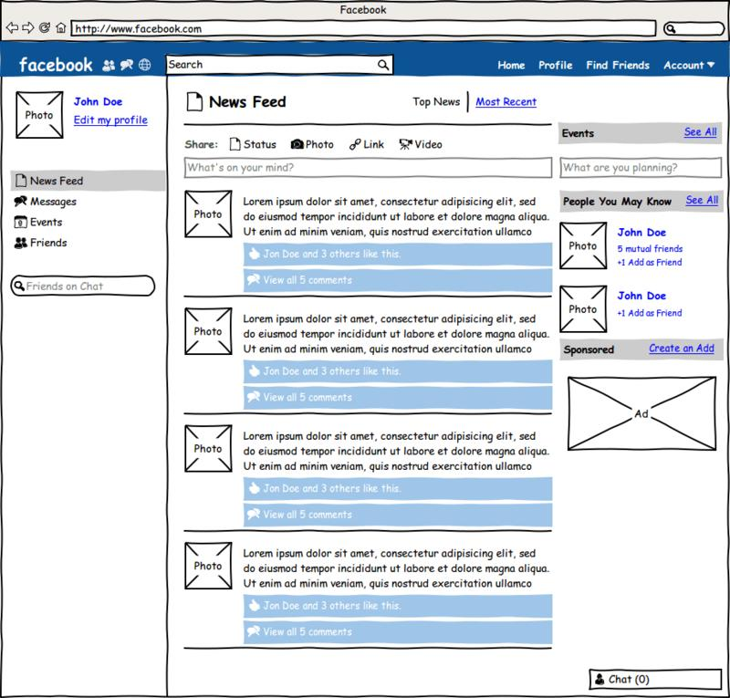
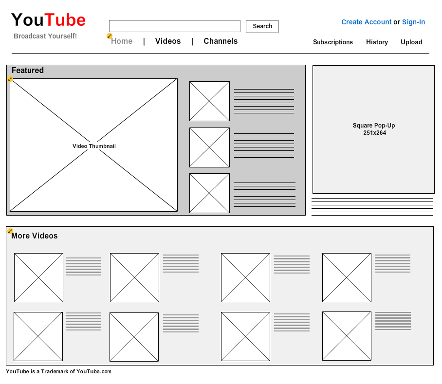

# HomeWorks Session 1 & 2

- Dùng một trong các cộng cụ phần phềm như:
  - ilusstrator, photoshop, excel, world,
  - figma, ADOBE XD
  - Wireframe, <https://moqups.com/>
- Yêu cầu: Dựng một layout phác thảo về bố cục, thành phần một website mà bạn thích.
- Layout phác thảo là gì ? Xem hình ví dụ dưới đây.

Facebook-Hand-version

Youtube-Figma-version.png
