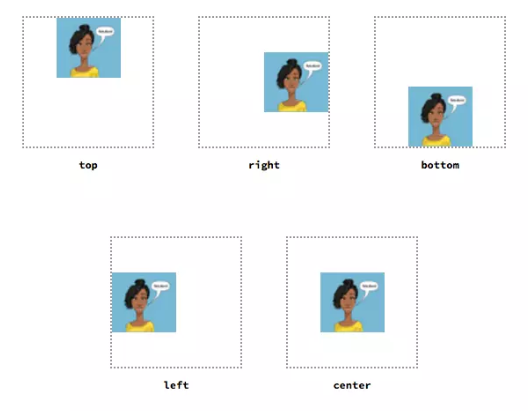

# ⭐Định dạng văn bản sử dụng các Tag đơn giản


## ✅ Heading là gì

Thẻ Heading hay còn gọi là các thẻ H1, H2, H3, H4, H5, H6. Đây là thứ tự ưu tiên của các chuyên mục trong bài viết theo mức độ giảm dần từ H1 -> H6.

Thông thường có 3 thẻ được sử dụng nhiều nhất trong việc tối ưu website đó là H1, H2, H3. Các heading được dùng để nhấn mạnh nội dung của chính chủ đề đang được nói đến.

- Thẻ Heading H1:  Nội dung chính mà bạn muốn nói đến, thông thường người ta sẽ đặt từ khóa chính vào trong thẻ này nhằm nhấn mạnh nội dung cần muốn nói đến là gì. Bạn nên đặt 1 thẻ H1 cho một page thì tốt hơn và nên đặt H1 chính là tiêu đề bài viết là hợp lý nhất.

- Thẻ Heading H2: Mô tả ngắn gọn cho nội dung chính bổ trợ cho thẻ H1. Bạn có thể sử dụng nhiều hơn thẻ H1 cho từng trường hợp . Nhưng thường thì bạn nên sử dụng từ 3- 5 thẻ H2 là hợp lý nhất .

- Thẻ Heading H3: Thẻ này được sử dụng để mô tả chi tiết cho từng ý trong bài được cụ thể hơn. Bạn nên kết hợp 3 thẻ này cho Website của bạn sẽ đạt hiệu quả cao hơn.

- Thẻ Heading H4: Với thẻ này thì thường được sử dụng mô tả cho những sản phẩm hoặc dịch vụ ít liên quan đến những cái chính.

Cách sử dụng thẻ Heading

```html
<h1>Heading 1</h1>
<h2>Heading 2</h2>
<h3>Heading 3</h3>
<h4>Heading 4</h4>
<h5>Heading 5</h5>
<h6>Heading 6</h6>
```

## ✅ Định dạng text với các thẻ cơ bản


- Thẻ `<p>`: Hiển thị 1 đoạn văn bản | Cách sử dụng:  `<p>This is paragraph</p>`
- Thẻ `<div>`: Chia bố cục ra thành từng phần | Cách sử dụng:  `<div>This is header</div>`
- Thẻ `<b>`: Bôi đậm | Cách sử dụng:  `<b>I am Bold</b>`
- Thẻ `<del>`: gạch ngang (xóa) | Cách sử dụng:  `<del>I am Del</del>`

- Thẻ `<u>`: gạch chân | Cách sử dụng:  `<u>I am underline</u>`

- Thẻ `<i>`: in nghiêng | Cách sử dụng:  `<i>I am Roma</i>`

- Thẻ `<small>`: font size chữ nhỏ hơn | Cách sử dụng:  `<small>I am small</small>`


**Thẻ `<pre>`**

Dùng để hiển thị văn bản dưới dạng bố cục cố định (preformatted text). 

Thẻ `<pre>` được sử dụng để bảo toàn định dạng và khoảng trắng trong văn bản, bao gồm cả các dòng trống và dấu cách.

```html
<pre>
    let x = 1;
    let y = 4:
    let total = x + y;
</pre>
```

Khi hiển thị ra ngoài trình duyệt, thì vẫn giữ được cấu trúc dấu cách, xuống hàng.

```html
<p>
    let x = 1;
    let y = 4:
    let total = x + y;
</p>
```

Nếu ví dụ trên được thay bằng thẻ p, thì kết quả được các dòng đó dồn lại 1 hàng.

**Thẻ `<em>`**

Trong HTML, thẻ `<em>` được sử dụng để đánh dấu một phần văn bản cần nhấn mạnh hoặc làm nổi bật. "em" là viết tắt của từ "emphasis" (nhấn mạnh).

Style mặc định của nó là in nghiêng

```html
<p>This is an <em>important</em> message.</p>
```

**Thẻ `<strong>`**

Trong HTML, thẻ `<strong>` được sử dụng để đánh dấu một phần văn bản cần nhấn mạnh một cách quan trọng hơn thẻ `<em>`. Thẻ `<strong>` thường được sử dụng để làm nổi bật một từ, cụm từ hoặc đoạn văn bản quan trọng trong ngữ cảnh với style in đậm.

```html
<p>This is a <strong>critical</strong> issue that needs immediate attention.</p>
```

**Thẻ `<dfn>`**

Trong HTML, thẻ `<dfn>` được sử dụng để định nghĩa một thuật ngữ hoặc khái niệm trong văn bản. "dfn" là viết tắt của từ "definition" (định nghĩa).

```html
<p>The <dfn>HTML</dfn> stands for HyperText Markup Language.</p>
```

**Thẻ `<code>`**

Rrong HTML, thẻ `<code>` được sử dụng để bao bọc đoạn mã nguồn hoặc mã máy tính trong văn bản. Thẻ `<code>` giúp phân biệt đoạn mã nguồn và mã máy tính với nội dung chung trong văn bản thông thường

```html
<p>
To print "Hello, world!" in Python, use the <code>print("Hello, world!")</code>
statement.
</p>
```

**Thẻ `<samp>`**

Trong HTML, thẻ `<samp>` được sử dụng để hiển thị đầu ra (output) của một đoạn mã hoặc một đoạn mã mẫu. "samp" là viết tắt của từ "sample" (mẫu).

```html
<p>The output of the program is: <samp>Hello, world!</samp></p>
```

**Thẻ `<cite>`**

Trong HTML, thẻ `<cite>` được sử dụng để định dạng một nguồn trích dẫn hoặc một tác phẩm được trích dẫn trong văn bản. Thẻ `<cite>` thông thường được sử dụng để bao bọc tên của một tác phẩm, tác giả, hoặc nguồn tham khảo.

```html
<p>
    <cite>“Tao muốn làm người lương thiện... Không được! Ai cho tao lương thiện? Làm thế nào cho mất những vết mảnh chai trên mặt này? Tao không thể là người lương thiện nữa…”.</cite> Câu nói cuối cùng của Chí Phèo đã bộc lộ rõ chủ đề tác phẩm. Hãy phân tích và chứng minh
</p>
```

Trong cite thường chỉ là text

**Thẻ `<blockquote>`**

rong HTML, thẻ `<blockquote>` được sử dụng để định dạng một đoạn trích dẫn dài hoặc một đoạn văn được trích dẫn từ một nguồn khác trong văn bản. Thẻ `<blockquote>` thường được sử dụng để làm nổi bật các phần trích dẫn hoặc đoạn văn quan trọng, và thường được hiển thị với định dạng thụt vào hoặc có viền xung quanh để phân biệt với phần còn lại của văn bản.


```html
<blockquote>
  <p>"Hãy làm việc chăm chỉ, đam mê và không bao giờ từ bỏ. Sự đổi mới chỉ đến thông qua tiếp tục nỗ lực và kiên trì."</p>
  <cite>Thomas Edison</cite>
</blockquote>
```

Trong blockquote có thể chưa các elements khác

## ✅ Danh sách và các kiểu danh sách


**Danh sách sau đây gọi là danh sách có thứ tự**


Để thể hiện danh sách có thứ tự ta sử dụng cặp thẻ: `<ol></ol>` và `<li></li>`, trong đó:

- `<ol></ol>` là viết tắt của chữ "ordered list" có nghĩa là danh sách có thứ tự.
- `<li></li>` viết tắt của chữ "list item" có nghĩa là mục của danh sách.


```html
<ol>
    <li>Cá lóc kho tiêu</li>
    <li>Cá rô kho tộ</li>
    <li>Cá thu chiên xoài bằm</li>
    <li>Cá điêu hồng nấu ngót</li>
</ol>
```
Hiển thị ra trình duyệt


**Danh sách sau đây gọi là danh sách không có thứ tự**

Để thể hiện danh sách không có thứ tự ta sử dụng cặp thẻ: `<ul></ul>` và `<li></li>`, trong đó:

- `<ul></ul>`  là viết tắt của chữ: unordered list có nghĩa là danh sách không có thứ tự
- `<li></li>` viết tắt của chữ: list item có nghĩa là mục của danh sách.
Danh sách sau đây gọi là danh sách không có thứ tự:

```html
<ul>
<li>Trang chủ</li>
<li>Giới thiệu</li>
<li>Sản phẩm</li>
<li>Dịch vụ</li>
<li>Liên hệ</li>
</ul>
```

Hiển thị ra trình duyệt


**Cú pháp đúng**

- Bên trong thẻ `<ol></ol>` (hoặc `<ul></ul>`) chỉ chứa trực tiếp một thẻ duy nhất `<li></li>`.
- Bên trong thẻ `<li></li>` chứa được hầu hết các thẻ HTML/HTML5, tuy nhiên không được chứa một số thẻ sau đây: `<html></html>`, `<meta></meta>`, `<body></body>`, `<title></title>`, `<link></link>`. Và một số thẻ không nên chứa như: `<style></style>`, `<script></script>`.

**Có thể lồng các list vào nhau**

```html
<ul>
    <li><p>Cơm trưa</p>
        <ul>
            <li>Cơm chiên hải sản</li>
            <li>Cơm sườn non nấu cam</li>
            <li>Cơm canh chua cá lóc</li>
        </ul>
    </li>
    <li>
        <p>Tráng miệng trái cây</p>
        <ul>
            <li>Nho tươi</li>
            <li>Chuối</li>
            <li>Mận</li>
        </ul>
    </li>
</ul>
```

Hiển thị ra trình duyệt


Danh sách các kiểu style xem link: <https://www.w3schools.com/cssref/pr_list-style-type.php>

**Dan sách đề mục**

Trong HTML, thẻ `<dl>`, `<dt>`, và `<dd>` được sử dụng để tạo danh sách định nghĩa trong văn bản. Đây là một cấu trúc phổ biến để hiển thị các thuật ngữ và định nghĩa tương ứng của chúng.

- Thẻ `<dl>`: Đây là thẻ cha để bao bọc toàn bộ danh sách định nghĩa. Nó đại diện cho danh sách và bao gồm các cặp `<dt>` và `<dd>`.

- Thẻ `<dt>`: Đây là thẻ con của `<dl>` và được sử dụng để định nghĩa một thuật ngữ hoặc mục đích. Thẻ `<dt>` đứng trước thẻ `<dd>` và thường được hiển thị với định dạng in đậm hoặc gạch chân để làm nổi bật thuật ngữ.

- Thẻ `<dd>`: Đây là thẻ con của `<dl>` và được sử dụng để cung cấp định nghĩa hoặc giải thích cho thuật ngữ hoặc mục đích đã được định nghĩa trong thẻ `<dt>`. Thẻ `<dd>` đứng sau thẻ `<dt>` và thường được hiển thị với định dạng thông thường.

Dưới đây là một ví dụ về cách sử dụng thẻ `<dl>`, `<dt>`, và `<dd>`:

```html
<dl>
  <dt>HTML</dt>
  <dd>Viết tắt của HyperText Markup Language, là ngôn ngữ đánh dấu siêu văn bản được sử dụng để tạo và định dạng các trang web.</dd>
  
  <dt>CSS</dt>
  <dd>Viết tắt của Cascading Style Sheets, là ngôn ngữ được sử dụng để định dạng và trình bày các thành phần của trang web.</dd>
  
  <dt>JavaScript</dt>
  <dd>Một ngôn ngữ lập trình phía client thường được sử dụng để tạo các tương tác động và cải thiện trải nghiệm người dùng trên trang web.</dd>
</dl>
```

Trong ví dụ trên, chúng ta tạo một danh sách định nghĩa với ba cặp `<dt>` và `<dd>`. Mỗi `<dt>` đại diện cho một thuật ngữ và `<dd>` chứa định nghĩa hoặc giải thích tương ứng. Khi được hiển thị trên trình duyệt, danh sách định nghĩa sẽ có dạng thuần túy và giúp người đọc dễ dàng nhận biết các thuật ngữ và định nghĩa tương ứng của chúng.

## ✅ Background color and image

**Tô màu nền cho một element**

```html
<!-- hex color name -->
<h1 style="background-color: red">Heading</h1>
<!-- hex --> 
<div style="background-color: #f60">

<!-- rgb --> 
<div style="background-color: rgb(0,0,0)">
```
Xem thêm về Gradient CSS

Builder Online: <https://cssgenerator.org/gradient-css-generator.html>


**background-image**

Xem thêm: https://www.w3schools.com/html/html_images_background.asp

Thuộc tính background-image định nghĩa cho hình nền của một thành phần. Nó là giá trị được định nghĩa bằng một đường dẫn hình ảnh với ký hiệu url(). Giá trị non có thể được sử dụng, nó được tính là một lớp.

```css
.left { background-image: url('ire.png'); }
.right { background-image: none; }
```


**background-repeat**

Thuộc tính background-repeat kiểm soát cách lặp lại của hình nền sau khi nó được đặt kích thước (bởi thuộc tính background-size) và vị trí (bởi thuộc tính background-position)

```css
.top-outer-left { background-repeat: repeat-x; }
.top-inner-left { background-repeat: repeat-y; }
.top-inner-right { background-repeat: repeat; }
.top-outer-right { background-repeat: space; }

.bottom-outer-left { background-repeat: round; }
.bottom-inner-left { background-repeat: no-repeat; }
.bottom-inner-right { background-repeat: space repeat; }
.bottom-outer-right { background-repeat: round space; }

```
Tương ứng với từng giá trị ta có được kết quả như hình


**background-size**

Thuộc tính background-size định nghĩa kích thước của hình nền. Giá trị của nó có thể là kích thước chiều dài và rộng hoặc là tỉ lệ phần trăm. Từ khóa có sẵn cho thuộc tính là contain và cover

Thuộc tính CSS "background-size: contain;" được sử dụng để điều chỉnh kích thước của hình ảnh nền sao cho nó vừa với kích thước của phần tử chứa nó mà không bị bóp méo hoặc cắt bỏ.

Khi bạn đặt `background-size: contain;`, hình ảnh nền sẽ được co giãn hoặc thu nhỏ để vừa với kích thước của phần tử chứa nó, trong đó:

- Nếu kích thước của hình ảnh nhỏ hơn kích thước của phần tử chứa, hình ảnh sẽ được co giãn lên để điền vào phần tử mà không làm biến dạng hình ảnh ban đầu. Tuy nhiên, tỷ lệ chiều rộng/chiều cao của hình ảnh sẽ được giữ nguyên.
- Nếu kích thước của hình ảnh lớn hơn kích thước của phần tử chứa, hình ảnh sẽ được thu nhỏ xuống sao cho nó vừa với phần tử mà không bị cắt bỏ. Các phần không đủ để hiển thị hình ảnh sẽ hiển thị màu nền hoặc nội dung khác của phần tử (tùy thuộc vào cấu trúc HTML và CSS khác).

Ví dụ, giả sử bạn có một phần tử "<div>" có kích thước 400px x 200px và bạn đặt hình ảnh nền với kích thước 800px x 600px và áp dụng "background-size: contain;". Hình ảnh sẽ được thu nhỏ xuống thành 400px x 300px để vừa với kích thước của phần tử "<div>". Khi đó, phần tử "<div>" sẽ hiển thị hình ảnh thu nhỏ không bị bóp méo và không có phần bị cắt bỏ.

Cần lưu ý rằng khi sử dụng "background-size: contain;", tỷ lệ giữa chiều rộng và chiều cao của hình ảnh sẽ được giữ nguyên. Điều này có thể dẫn đến việc hình ảnh không điền đầy toàn bộ phần tử chứa nếu tỷ lệ khác nhau.


Thuộc tính CSS `background-size: cover;` được sử dụng để điều chỉnh kích thước của hình ảnh nền sao cho nó che đậy toàn bộ phần tử chứa nó mà không bị biến dạng.


Khi bạn đặt `background-size: cover;`, hình ảnh nền sẽ được co giãn hoặc thu nhỏ để che đậy toàn bộ phần tử chứa nó, trong đó:

- Nếu kích thước của hình ảnh nhỏ hơn kích thước của phần tử chứa, hình ảnh sẽ được co giãn lên hoặc thu nhỏ xuống để che đậy toàn bộ phần tử mà không làm biến dạng hình ảnh ban đầu. Tuy nhiên, tỷ lệ chiều rộng/chiều cao của hình ảnh sẽ được giữ nguyên.
- Nếu kích thước của hình ảnh lớn hơn kích thước của phần tử chứa, hình ảnh sẽ được cắt bỏ hoặc thu nhỏ xuống để phù hợp với kích thước của phần tử mà không bị biến dạng. Phần hình ảnh được hiển thị sẽ che đậy toàn bộ phần tử, và các phần không đủ để hiển thị sẽ bị cắt bỏ.

Ví dụ, giả sử bạn có một phần tử "<div>" có kích thước 400px x 200px và bạn đặt hình ảnh nền với kích thước 800px x 600px và áp dụng "background-size: cover;". Hình ảnh sẽ được co giãn lên thành 800px x 400px để che đậy toàn bộ phần tử "<div>". Khi đó, phần tử "<div>" sẽ hiển thị hình ảnh co giãn mà không bị biến dạng và không có phần bị cắt bỏ.


Cần lưu ý rằng khi sử dụng "background-size: cover;", tỷ lệ giữa chiều rộng và chiều cao của hình ảnh sẽ được giữ nguyên. Điều này có thể dẫn đến việc hình ảnh bị cắt bỏ ở các phần không đủ để hiển thị nếu tỷ lệ khác nhau.


**background-position**

Thuộc tính CSS "background-position" được sử dụng để xác định vị trí xuất hiện của hình ảnh nền trong phần tử chứa nó. Nó cho phép bạn chỉ định vị trí theo các giá trị như pixel, phần trăm hoặc từ khoá như "left", "right", "center", "top", "bottom".

Thường Dùng kèm với background-size và background-repeat: no-repeat

```css
background-position: x-axis y-axis;
```



**background-origin**

Thuộc tính CSS "background-origin" được sử dụng để xác định điểm gốc (origin) của hình ảnh nền trong phần tử. Nó quyết định vị trí bắt đầu vẽ hình ảnh nền và cách hình ảnh nền được căn chỉnh trong phần tử chứa nó.


**Tô màu văn bản text**

```html
<h1 style="color: red">Heading</h1>
```
Các kiểu giá trị màu:

- Color name: red, yellow, blue
- Hex: #fff, #000, #f60
- RGB: Black = (0,0,0)


Chi tiết về màu xem link: <https://www.w3schools.com/html/html_colors.asp>