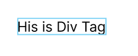
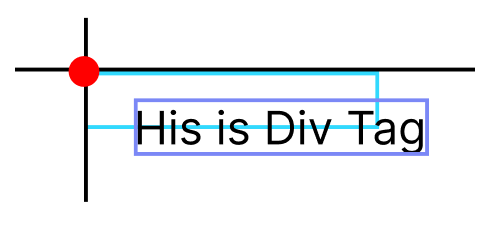
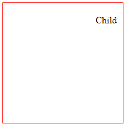

# Session 4 - Định dạng sử dụng CSS

## ⭐ 1.Kiểu chữ và Font chữ

- Css Formatting Text
  - color
  - font-size
  - font-weight
  - font-style
  - text-overflow
  - text-transform
  - text-align
  - text-shadow
  - text-index
  - text-decoration
  - line-height
  - font-family
- Google Font, CDN Font: <https://www.w3schools.com/css/css_font.asp>
- Font icon

## ⭐ 2.CSS Box Model

### 2.1 Box Model ?


Demo boxmodel.html

### 2.3 Width và  Height của một Element

The total width of an element should be calculated like this:

> Total element width = width + left padding + right padding + left border + right border + left margin + right margin

The total height of an element should be calculated like this:

> Total element height = height + top padding + bottom padding + top border + bottom border + top margin + bottom margin

### 2.3 Khác nhau giữa các thành phần của Box Model

**Content** - Là phần content của box

**Padding** - Khoảng trống xung quanh box. Padding là trong suốt

**Border** - là phần viền xung quanh padding và content

**Margin** - Phần khoảng trống nằm ngoài  border. Margin là trong suốt

================================

Để thay được ta đi tìm hiểu chi tiết từng thành phần

### 🌻 padding

Tạo vùng đệm giữa phần nội dùng và border của element

Syntax

```css

padding-left: 1em;
padding-right: 1em;
padding-top: 1em;
padding-bottom: 1em;

/* Short Hand ==> Apply to all four sides */
padding: 1em;
/* top and bottom | left and right */
padding: 5% 10%;
/* top | left and right | bottom */
padding: 1em 2em 2em;
/* top | right | bottom | left */
padding: 5px 1em 0 2em;
```

Demo: padding-demo.html

### 🌻 Border

Tạo đường viền cho elements

Syntax:

```css
/* syntax details */
border-left-with:1px;
border-left-color: red;
border-left-style: solid;

/* short hand */
/* width | style | color */
border: medium dashed green;
border: 1px solid #ddd;
```

More example: Basic Example Folder

Buider Online: <https://cssgenerator.org/border-css-generator.html>

### 🌻 margin

Tạo khoảng cách giữa các elements

Syntax

```css
margin-top:1em;
margin-bottom:1em;
margin-left:1em;
margin-right:1em;
/* Apply to all four sides */
margin: 1em;
margin: -3px;
/* top and bottom | left and right */
margin: 5% auto;
/* top | left and right | bottom */
margin: 1em auto 2em;
/* top | right | bottom | left */
margin: 2px 1em 0 auto;
```

Demo: margin-demo.html

Một số thuộc tính thường dùng chung khác:

### 📌 box-sizing

Thuộc tính CSS "box-sizing" được sử dụng để xác định cách tính toán kích thước của một phần tử và xác định liệu có bao gồm padding và border trong kích thước của phần tử hay không.

Syntax

```css
box-sizing: border-box;
box-sizing: content-box;
```

Trong đó, "value" có thể là một trong các giá trị sau:

- "content-box" (giá trị mặc định): Kích thước của phần tử chỉ tính đến khu vực nội dung (content) và không bao gồm padding và border. Trong trường hợp này, kích thước của phần tử sẽ là tổng của kích thước nội dung và các padding và border được thêm vào.

- "border-box": Kích thước của phần tử bao gồm cả khu vực nội dung, padding và border. Trong trường hợp này, kích thước của phần tử sẽ chỉ là kích thước đã xác định và không bị ảnh hưởng bởi các padding và border. Nội dung sẽ được co giãn hoặc thu nhỏ để phù hợp trong kích thước đã xác định.

Demo: box-sizing.html

### 📌 border-radius

Bo gốc cho elements


Syntax:

```css
/* The syntax of the first radius allows one to four values */
/* Radius is set for all 4 sides */
border-radius: 10px;
/* top-left-and-bottom-right | top-right-and-bottom-left */
border-radius: 10px 5%;
/* top-left | top-right-and-bottom-left | bottom-right */
border-radius: 2px 4px 2px;
/* top-left | top-right | bottom-right | bottom-left */
border-radius: 1px 0 3px 4px;

/* The syntax of the second radius allows one to four values */
/* (first radius values) / radius */
border-radius: 10px / 20px;
/* (first radius values) / top-left-and-bottom-right | top-right-and-bottom-left */
border-radius: 10px 5% / 20px 30px;
/* (first radius values) / top-left | top-right-and-bottom-left | bottom-right */
border-radius: 10px 5px 2em / 20px 25px 30%;
/* (first radius values) / top-left | top-right | bottom-right | bottom-left */
border-radius: 10px 5% / 20px 25em 30px 35em;
```

Builder Online: <https://cssgenerator.org/border-radius-css-generator.html>

### 📌 box-shadow

Đổ bóng cho elements

Syntax

```css
/* Keyword values */
box-shadow: none;
/* offset-x | offset-y | color */
box-shadow: 60px -16px teal;
/* offset-x | offset-y | blur-radius | color */
box-shadow: 10px 5px 5px black;
/* offset-x | offset-y | blur-radius | spread-radius | color */
box-shadow: 2px 2px 2px 1px rgba(0, 0, 0, 0.2);
/* inset | offset-x | offset-y | color */
box-shadow: inset 5em 1em gold;
/* Any number of shadows, separated by commas */
box-shadow: 3px 3px red, -1em 0 0.4em olive;
```

Builder Online: <https://cssgenerator.org/box-shadow-css-generator.html>

### 📌 overflow

Syntax

```css
/* Keyword values */
overflow: visible;
overflow: hidden;
overflow: clip;
overflow: scroll;
overflow: auto;
overflow: hidden visible;
```

Demo Online: <https://developer.mozilla.org/en-US/docs/Web/CSS/overflow>

## ⭐ 3. Horizontal Alignment - Canh theo chiều ngang

- text-align
- margin: number auto;

## ⭐ 4. Vertical Alignment - Canh theo chiều dọc

- Vertical Alignment a Image follow text
- Vertical Alignment a text follow table cell
- Vertical Alignment a Element follow Div Tag

## ⭐ 5. Display Property

- display: inline, inline-block, block, table, table-cell...
- float: left, right, unset
- clear: left, right, unset, both

Doc Guide: <https://developer.mozilla.org/en-US/docs/Web/CSS/display>

## ⭐ 6. Position

Thuộc tính CSS "position" được sử dụng để xác định cách phần tử trong HTML được định vị và vị trí của nó trong một tài liệu web.

Cú pháp của "position" là:

```css
position: value;
```

Trong đó, "value" có thể là một trong các giá trị sau:

1. "static" (giá trị mặc định): Phần tử được định vị theo luồng tự nhiên của tài liệu. Thuộc tính "top", "right", "bottom" và "left" không có hiệu lực khi sử dụng "position: static".

1. "relative": Phần tử được định vị dựa trên vị trí ban đầu của nó trong luồng tự nhiên của tài liệu. Bằng cách sử dụng các thuộc tính "top", "right", "bottom" và "left", phần tử có thể được dịch chuyển từ vị trí ban đầu của nó.

1. "fixed": Phần tử được định vị dựa trên cửa sổ trình duyệt, với vị trí cố định không thay đổi khi cuộn trang. Phần tử sẽ được đặt tại vị trí xác định bằng các thuộc tính "top", "right", "bottom" và "left".

1. "absolute": Phần tử được định vị dựa trên phần tử cha gần nhất có thuộc tính "position" khác "static". Nếu không có phần tử cha nào có thuộc tính "position" khác "static", phần tử sẽ được định vị dựa trên cơ sở của thẻ <html>. Cũng giống như "fixed", phần tử sẽ được đặt tại vị trí xác định bằng các thuộc tính "top", "right", "bottom" và "left".

1. "sticky": Phần tử được định vị dựa trên vị trí của nó trong luồng tự nhiên của tài liệu cho đến khi cuộn đến một ngưỡng xác định, sau đó nó sẽ "dính" vào vị trí và không di chuyển khi cuộn tiếp. Cũng giống như "relative", phần tử có thể được dịch chuyển bằng cách sử dụng các thuộc tính "top", "right", "bottom" và "left".

**Ví dụ 1 - relative**

```html
<div>This is Div Tag</div>
```

```css
div {
  position: relative;
}
```



Chúng ta set cho `div` thuộc tính ` position: relative;` nhưng về mặt giao diện vẫn chưa có gì xảy ra.

Thử kết hợp thêm: "top", "right", "bottom" và "left"
```css
div {
  position: relative;
  top: 10px; /* có thể là giá trị âm */
  /*
    Nếu không set left thì mặc định là canh theo hướng trái: left: 0
  */
  left: 20px;
}
```



Trong ví dụ trên, phần tử `<div>` sẽ được định vị tương đối (relative) so với chính nó và dịch chuyển 10 pixel từ vị trí ban đầu theo hướng top và 20 pixel theo hướng left.

Trong hình minh họa trên:
- ô màu xanh là vị trí gốc, và nếu dùng top, left thì tọa độ 0,0 là ngay CHẤM ĐỎ.
- ô màu tím là vị trí mới sau khi dịch chuyển

Tương tự như vậy: CHẤM ĐỎ trên có thể rơi vào 3 góc còn lại khi kết hợp : "top", "right", "bottom" và "left"


**Ví dụ 2 - absolute**

Thuộc tính CSS `position: absolute` được sử dụng để định vị một phần tử dựa trên phần tử cha gần nhất có thuộc tính "position" khác "static". Nếu không có phần tử cha nào có thuộc tính "position" khác "static", phần tử sẽ được định vị dựa trên cơ sở của thẻ `<html>`.

```html
<div>
  <span>Child</span>
</div>
```

```css
div {
  position: relative;
  /* Tạo khung để biến giới hạn của div */
  width: 200px;
  height: 200px;
  border: 1px solid red;
}

span {
  position: absolute;
  top: 20px;
  right: 10px;
}
```

Kết quả được như hình



- Khi set top và right thì thì nó sẽ lấy góc trên bên phải của element CHA (div) là vị trí tọa độ gốc
- top: 20px - Dịch ra so với tọa độ gốc, về bên dưới (hướng canh dọc là top )
- right: 10px - Dịch ra so với tọa độ gốc, về bên trái (hướng canh ngang là right)