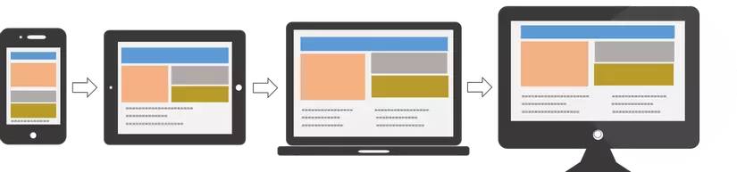

# Displaying-Graphics-and-CSS3-Animation

## ⭐ 1.Format Image Css in Content

- Chèn ảnh
- Sử dụng with, height để set chiều rộng và cao cho hình
- sử dụng border, border-radius
- Hình ảnh sử dụng opacity
- Hình ảnh có responsive
- Example: <https://www.w3schools.com/css/css3_images.asp>

Công cụ chỉnh sửa ảnh Online: <https://pixlr.com>


## 🌻 padding

Tạo vùng đệm giữa phần nội dùng và border của element

Syntax

```css

padding-left: 1em;
padding-right: 1em;
padding-top: 1em;
padding-bottom: 1em;

/* Short Hand ==> Apply to all four sides */
padding: 1em;
/* top and bottom | left and right */
padding: 5% 10%;
/* top | left and right | bottom */
padding: 1em 2em 2em;
/* top | right | bottom | left */
padding: 5px 1em 0 2em;
```

## ⭐ 2. CSS3 Animation

### 2.1 Transition


Transition hoạt động bằng cách thay đổi giá trị thuộc tính một cách trơn tru từ giá trị NÀY sang giá trị KHÁC trong khoảng thời gian nhất định. Các tham số thường được sử dụng:

- transition-delay: khoảng thời gian dừng cho mỗi hiệu ứng chuyển đổi.
- transition-duration: khoảng thời gian chuyển đổi diễn ra.
- transition-property: thuộc tính cần chuyển đổi.
- transition-timing-function: tốc độ chuyển đổi diễn ra

Cú pháp: 

```css
div {
  width: 100px;
  height: 100px;
  background: red;

  transition-property: width;
  transition-duration: 2s;
  transition-timing-function: linear;
  transition-delay: 1s;
  /* shorthand */
  transition: width 2s linear 1s;
}
/* rê chuột lên thẻ div sẽ thay đổi chiều rộng lên 300px */
div:hover {
  width: 300px;
}
```

Thuộc tính transition-timing-function dùng để xác định tốc độ thay đổi khi chuyển đổi.

Các giá trị có sẵn như sau:

- ease: tạo hiệu ứng chuyển đổi khi bắt đầu thì chậm sau đó nhanh dần và gần kết thúc lại chậm từ từ (giá trị mặc định).
- linear: tạo hiệu ứng chuyển đổi từ lúc bắt đầu với lúc kết thúc tốc độ là như nhau.
- ease-in: tạo hiệu ứng chuyển đổi chậm ở lúc bắt đầu.
- ease-out: tạo hiệu ứng chuyển đổi chậm ở lúc kết thúc.
- ease-in-out: tạo hiệu ứng chuyển đổi chậm ở lúc bắt đầu và lúc kết thúc.


 Demo transition-timing-function: 
<https://www.joshwcomeau.com/animation/css-transitions/>


### 2.2 Animation - hoạt cảnh

-  **@keyframes**: dùng để thiết lập một chuyển động

    Cú Pháp 

    ```css
    @keyframes nameAnimation {
        ...code
    }
    ```

    Trong đó

    nameAnimation: là tên của chuyển động.

    Code: là các đoạn code cho tiến trình chuyển động.

- **animation-name**:  tác dụng xác định thành phần sẽ thực thi animation nào
    
    Cú pháp:
    ```css
    animation-name: nameAnimation;
    ```
- **animation-duration**: thiết lập khoảng thời gian thực thị 1 chuyển động animation

    Cú pháp: 
    ```css
    animation-duration: 2s; /* time - seconds */
    ```

- **animation-timing-function** : xác định tốc độ chuyển động của một animation sẽ như thế nào
    Cú pháp: 
    ```css
    animation-timing-function: value; /* ease, linear...*/
    ```
- animation-delay : xác định độ trễ của mỗi lượt chuyển động
    Cú pháp: 
    ```css
    animation-delay: 2s; /* time - seconds */
    ```
- **animation-iteration-count**: thiết lập số lần thực hiện một animation
    Cú pháp: 
    ```css
    animation-iteration-count: number | infinite;
    ```
    Với `infinite` là lặp vô tận
- **animation-direction** : xác định xem chiều chạy của animation sẽ như thế nào
    Cú pháp: 
    ```css
    aniamtion-direction: normal|reverse|alternate|alternate-reverse|initial|inherit;
    ```
- **animation-fill-mode**: xác định trạng thái của một animation, khi mà animation không được chạy (có thể là animation này đã chạy xong hoặc đang bị delay)
    Cú pháp: 
    ```css
    animation-fill-mode: none|forwards|backwards|both|initial|inherit;
    ```
- **animation-play-state**: xác định trạng thái của animation
    Cú pháp: 
    ```css
    animation-duration: paused|running|initial|inherit;
    ```

Các bạn có thể search keywords: Ví dụ: animation-fill-mode w3school --> để xem ví dụ từng trường hợp.

Ví dụ giải thích từng thuộc tính: <https://viblo.asia/p/hieu-biet-them-ve-animation-trong-css3-gDVK2wOeZLj>

Demo cách áp dụng: <https://quantrimang.com/hoc/animation-trong-css-163546>

====================================

### 2.3 Transforms 2D, 3D - biến hình, thay đổi hình dạng

Xem thêm: 
- <https://www.w3schools.com/css/css3_2dtransforms.asp>
- <https://www.w3schools.com/css/css3_3dtransforms.asp>

==============

Xem thêm tài liệu: 

- <https://animate.style/#best-practices>
- <https://www.w3schools.com/css/css3_animations.asp>
- <https://www.w3schools.com/cssref/css_animatable.php>
- <https://michalsnik.github.io/aos/>

Một số Demo: <https://blog.hubspot.com/website/css-animation-examples>


## ⭐ 4. CSS3 on Mobile devices (Responsive)

**Responsive** là gì ? Là kiểu hiển thị thích ứng, để làm sao khi xem trên các kích thước trình duyệt có màn hình hiển thị khác nhau như Desktop, Tablet, Mobile thì nó đều hiển thị cân đối, đầy đủ, thân thiện người dùng.

### 4.1 Viewport

Viewport là khung hình người dùng nhìn thấy trên thiết bị của họ khi vào một trang web bất kì. Với mỗi thiết khác nhau lại có viewport khác nhau.

```html
<meta name="viewport" content="width=device-width, initial-scale=1.0">

```

`width=device-width`: thiết lập chiều rộng của trang web theo chiều rộng của thiết bị

`initial-scale=1.0`: thiết lập mức độ zoom ban đầu khi trang web được load bởi trình duyệt

### 4.2 Media Queries

>Media Queries là một kỹ thuật CSS được giới thiệu trong CSS3. Ta sử dụng cú pháp @media để bao gồm một khối các thuộc tính CSS chỉ khi một điều kiện nhất định là đúng. Nói một cách đơn giản là ta sẽ định nghĩa CSS riêng cho một nhóm các thiết bị có kích thước giống nhau.

**Media Queries là cốt lõi để xây dựng một website có Responsive**

Cú pháp:

```css
@media not|only media_type and (feature:value) {
  CSS-Code;
}
```

Trong đó `media_type` có các giá trị:
| Giá trị | Mô tả|
|---------|------|
| all     | Tất cả thiết bị |
| screen | Màn hình desktop, tablet, mobile |
| print | khi in ấn |

Còn `feature:value` là biểu thức điều kiện

feature thường dùng nhất: min-width, max-width, device-min-width, device-max-width

Ví dụ Media theo quy tắc Mobile First

```css
*{
    margin: 0
}

body{
    font-family: Roboto;
    line-height: 1.4
}

/*Smart phone nhỏ*/
@media screen and (min-width: 320px){
    /*Áp dụng cho kích thước trình duyệt có chiều rộng tối thiểu >= 320px*/
    h1{
        color: red;
        font-size: 20px
    }
}
/*Iphone (480 x 640)*/
@media screen and (min-width: 375px){
     h1{
        font-size: 30px
    }
    /* h1 sẽ thừa kế được thuộc tính color từ điều kiện trước, và chỉ thay đổi font-size */
}
/*Tablet nhỏ (480 x 640)*/
@media screen and (min-width: 480px){

}
/*Ipad dọc (768 x 1024)*/
@media screen and (min-width: 768px){

}
/*Ipad ngang(1024 x 768)*/
@media screen and (min-width: 1024px){

}
/*Desktop (1200 x 768)*/
@media screen and (min-width: 1200px){

}

```



Ví dụ Media theo quy tắc Desktop First


Theo mình cứ nhớ công thức là max-width = min-width – 1 vậy đúng sẽ là max-width: 1023px nhé các bạn

```css

*{
    margin: 0
}

body{
    font-family: Roboto;
    line-height: 1.4
}

/*Desktop (1200 x 768)*/
@media screen and (max-width: 1199px){
    /*Áp dụng cho kích thước trình duyệt có chiều rộng tối đa <= 1200px */
}

/*Ipad ngang(1024 x 768)*/
@media screen and (max-width: 1023px){

}

/*Ipad dọc(768 x 1024)*/
@media screen and (max-width: 767px){

}
/*Tablet nhỏ(480 x 640)*/
@media screen and (max-width: 479px){

}
/*Iphone(480 x 640)*/
@media screen and (max-width: 374px){

}
/*Smart phone nhỏ*/
@media screen and (max-width: 319px){

}

```

Lưu ý: Phần CSS nằm ngoài @media là dùng chung.

>Tìm hiểu thêm: Nên theo trường phái nào ? Mobile First hay Desktop First ?

- <https://www.w3schools.com/css/css3_mediaqueries.asp>
- <https://www.w3schools.com/css/css3_mediaqueries_ex.asp>

