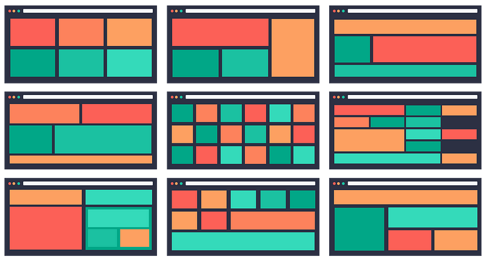
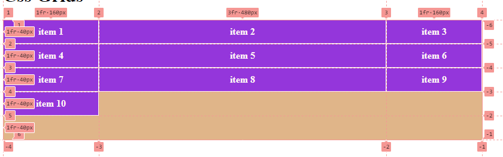

# Understanting-layout-in-Css3

## Css Flex box ?

Flexbox là một kiểu dàn trang (layout mode) mà nó sẽ tự cân đối kích thước của các phần tử bên trong để hiển thị trên mọi thiết bị. Nói theo cách khác, bạn không cần thiết lập kích thước của phần tử, không cần cho nó float, chỉ cần thiết lập nó hiển thị chiều ngang hay chiều dọc, lúc đó các phần tử bên trong có thể hiển thị theo ý muốn.

Dưới đây là sơ đồ cấu trúc Flexbox .


Hai thành phần quan trọng nhất trong một bố cục Flexbox là gồm container và item:

- Container: là thành phần lớn bao quanh các phần tử bên trong, bạn sẽ thiết lập kiểu hiển thị inline (sắp xếp theo chiều ngang) hoặc kiểu sắp xếp theo chiều dọc. Khi đó, các item bên trong sẽ hiển thị dựa trên thiết lập của container này.
- item: Các phần tử con của container được gọi là item, ở item bạn có thể thiết lập nó sẽ sử dụng bao nhiêu cột trong một container, hoặc thiết lập thứ tự hiển thị của nó.


### Css properties with Flex:

- **display**: flex | inline-flex
- **flex-direction**: row (default) | column | row-reverse | column-reverse
- **flex-wrap**: no-wrap (default) | wrap | wrap-reverse
- **flex-basic**: `<length>`
- **justify-content**: flex-start | flex-end | center | space-between | space-around
- **align-items**: flex-start | flex-end | center | baseline | stretch
- **align-content**: flex-start | flex-end | center | baseline | stretch
- **order**: `<number>`
- **flex-grow**: `<number>`
- **flex-shrink**: `<number>`
- **flex**:[flex-grow] [flex-shrink] [flex-basis]
- **flex-flow**: [flex-direction] [flex-wrap];

### Ví dụ

```html
<div class="flex-container">  
   <div class="item item1">item 1</div>  
   <div class="item item2">item 2</div>  
   <div class="item item3">item 3</div>  
</div>
```
Khi set display flex cho class .flex-container được kết quả


### justify-content

Phân phối items theo trục main axis


### align-items

Phân phối items theo trục cross axis


### align-content

Phân phối items theo trục cross axis, Nó chỉ có tác dụng khi có nhiều items trong container.

### order

Sắp xếp vị trí items theo thứ tự mong muốn

### flex-grow

Khi sử dụng flex-grow nó sẽ giúp ta sử dụng khoảng trống còn lại trong một box, hoặc độ rộng của div có flex-grow sẽ tăng lên bao nhiêu phần so với phần còn lại.

Ví dụ 1:

set cho class item1 thuộc tính `flex-grow: 1` và xem kết quả:


Chúng ta sẽ thấy Item 1 sẽ lấp đầy khoảng trống còn lại

Hoặc `flex: 1` chúng ta cũng được kết quả tương tự

Ví dụ 2: Set tất cả các item `flex-grow: 1` và xem kết quả


Như chúng ta thấy tất cả Item có độ rộng như nhau. đó là bởi vì chúng ta đã set cho chúng tỉ lệ như nhau.
 Bạn có thể hiểu flex-container bây giờ chia làm 3 phần, mỗi item chiếm 1 phần


 Ví dụ 3: set như sau

 ```css
.item1 {
  flex-grow: 3;
}
.item2 {
  flex-grow: 1;
}  
.item3 {
  flex-grow: 2;
}
 ```

Kết quả


Như các bạn thấy, mình có tổng cộng 3 Item. Và tổng giá trị của flex-grow sẽ là 3+2+1 = 6. Chúng ta sẽ có Item 1 sẽ chiếm 3/6, Item 2 là 2/6, Item 3 là 1/6. Kết quả ta được như hình trên

### flex-shrink

Shrink dịch ra là "co lại", tên gọi tương ứng với nhiệm vụ, nó sẽ co lại khi chúng ta thay đổi width của parent xuống.

Giá trị mặc định của flex-shrink là 1. Điều này có nghĩa là khi không đủ không gian, các item sẽ co lại theo tỷ lệ mặc định, nhưng không nhỏ hơn content bên trong nó 

```css
.flex-container {
    display: flex;
    height: 150px;
    max-width: 900px;
    background-color: burlywood;
}
.item {
    width: 300px;
    height: 50px;
    color: white;
    display: flex;
    align-items: center;
    justify-content: center;
}
.item1 {
    background-color: blue;
    /* flex-grow: 1; */
    flex-shrink: 0;
}
.item2 {background-color: red;
    /* flex-grow: 1 */
}
.item3 {background: yellowgreen;
    /* flex-grow: 1; */
    
}
```

Nếu đủ chiều rộng thì kết quả


Nếu không đủ chiều rộng thì kết quả


Đối với .item1, thuộc tính flex-shrink được đặt thành 0. Điều này có nghĩa là khi không đủ không gian để hiển thị tất cả các phần tử con, .item1 sẽ không co lại và giữ nguyên kích thước ban đầu của nó.

Đối với .item2, .item3 thuộc tính flex-shrink không được đặt giá trị cụ thể. Mặc định, giá trị của flex-shrink là 1. Điều này có nghĩa là khi không đủ không gian, .item2,3 sẽ co lại theo tỷ lệ mặc định.


Thao khảo minh họa từ các nguồn: 

Guide: <https://css-tricks.com/snippets/css/a-guide-to-flexbox/>

Cheat: <https://flex.eszter.space/>

Demo: <https://codepen.io/enxaneta/full/adLPwv/>

Flexbox Model (xem hình minh họa) -- <https://developer.mozilla.org/en-US/docs/Learn/CSS/CSS_layout/Flexbox#the_flex_model>


## Grid Css ?

Lợi ích của việc sử dụng Grid Layout: tạo bố cục linh hoạt, tương thích trên nhiều thiết bị, dễ dàng tạo các khu vực đa cột và đa hàng, tiết kiệm thời gian và tăng hiệu suất phát triển.

Dùng khi cần chia container thành nhiều phần có bố cục quá phức tạp mà "display: block" hoặc "display: flex" 

Hệ thống Grid Layout của CSS cung cấp một hệ thống bố cục dạng lưới, với cột và hàng mà không còn cần sử dụng đến `float` hay `position`


Bố cục phức tạp như hình sau:



### Tìm hiểu cấu trúc của một Grid


**1. Grid lines:**

- Grid lines là các đường phân chia grid thành các cột và hàng. Có thể nói rằng grid lines tạo ra lưới cho grid layout.
- Grid lines có thể được đánh số hoặc có thể được đặt tên để dễ dàng tham chiếu và xác định vị trí các phần tử trong grid.
- Có hai loại grid lines: vertical lines (đường dọc) và horizontal lines (đường ngang). Đường dọc tạo thành các cột, trong khi đường ngang tạo thành các hàng.

**2. Grid cells:**

- Grid cells là các ô vuông được tạo ra bởi sự giao nhau của các grid lines, tạo thành một lưới ô chứa nội dung.
- Mỗi grid cell có thể chứa một hoặc nhiều phần tử (grid items) hoặc cũng có thể là trống.
- Grid cells là đơn vị cơ bản để xác định vị trí và kích thước của các phần tử trong grid.


**3. Grid tracks:**

- Grid tracks là các đường chạy dọc hoặc ngang trong grid layout, tạo ra các cột hoặc hàng.
- Grid tracks có thể được xác định bằng cách chỉ định kích thước tường minh hoặc sử dụng đơn vị tỷ lệ (fr) để phân chia không gian tỷ lệ trong grid.
- Grid tracks có thể là cột (columns) hoặc hàng (rows) và chúng tạo nên cấu trúc chính của grid layout.

**4. Grid items:**

- Grid items là các phần tử con bên trong grid layout, được đặt trong các grid cells.
- Mỗi grid item có thể chiếm một hoặc nhiều grid cells, theo đó xác định vị trí và kích thước của nó trong grid.
- Grid items có thể được định vị bằng cách xác định grid lines hoặc sử dụng các thuộc tính như `grid-column` và `grid-row`.
- Grid items có thể chứa nội dung và được căn chỉnh hoặc bố trí bên trong grid cell.

**5. Grid Gap**

Grid gap là một thuộc tính trong CSS Grid Layout được sử dụng để xác định khoảng cách giữa các grid item trong grid layout.

**6. Grid template areas**

Grid template areas là một cách để xác định bố cục của grid layout bằng cách sử dụng tên khu vực (area names) để đại diện cho các phần tử trong grid.

Nói một cách dễ hiệu là ông CHA có một mảnh đất được chia thành các lô (tức là được display: grid):

- Lô (các cell) này ông chia cho đứa Con A, đóng một cái biển: Nguyen_Van_A trên đất
- Lô kia chia chia cho đứa Con B, đóng một cái biển: Nguyen_Van_B trên đất

### Cách sử dụng Grid

Xem thêm: 
- <https://www.w3schools.com/css/css_grid.asp>
- <https://www.moonlearning.io/blog/css-grid>

**Ví dụ 1**

```css
.grid-container {
   display: grid;
   background-color: burlywood;
   max-width: 800px;
}
.item {
   height: 40px;
   color: white;
   background-color: blueviolet;
   border: 1px solid #fff;
   font-weight: bold;
   display: flex;
   justify-content: center;
   align-items: center;
}
```

```html
<div class="grid-container">
   <div class="item item1">item 1</div>  
   <div class="item item2">item 2</div>  
   <div class="item item3">item 3</div>  
   <div class="item item4">item 4</div>  
   <div class="item item5">item 5</div>  
   <div class="item item6">item 6</div>  
   <div class="item item7">item 7</div>  
   <div class="item item8">item 8</div>
   <div class="item item9">item 9</div>
   <div class="item item10">item 10</div>
</div>
```

Kết quả


Theo ví dụ trên:

- Grid container là phần nên Gạch
- Gird items là các ô màu tím

Khi bạn set cho container một thuộc tính `display: grid` thì mặc định nó được chia 1 hàng , 1 cột như hình trên.

Mặc định các items sẽ chiếm 1 dòng, 1 cột

Lưu ý: Để xem đươc cấu trúc hàng cột: nhấn F12 mở DevTool, chọn tab Elements, bên phải chọn Layout


***

**Ví dụ 2**

Chia đất cho container thành 3 cột, không khai báo hàng

```css
.grid-container {
   display: grid;
   background-color: burlywood;
   max-width: 800px;
   /* 
   Cú pháp khai báo cột 
   với 3 cột, và mỗi cột có chiều rộng auto
   */
   grid-template-columns: auto auto auto;

}
```
Kết quả được như sau:


Các items sẽ được phân bổ theo thứ tự từ trên xuống dưới, từ trái qua phải, lấp vào các ô (cell)

Ở trên bạn chỉ khai báo số cột, còn số hàng grid tự sinh ra phù hợp theo số lượng items và có chiều cao tự động bằng với chiều cao của item

***

**Ví dụ 3** Set hàng và cột với một con số cố định

```css
.grid-container {
   display: grid;
   background-color: burlywood;
   max-width: 800px;
   /* Lưới 4 cột, 5 hàng */
   grid-template-columns: 200px 200px 200px 200px;
   /*
   Bạn có thể rút gọn lệnh trên khi 
   tất cả cột cùng chiều rộng
   lặp 4 lần
   grid-template-columns: repeat(4, 200px);
   */
   grid-template-rows: 40px 40px 40px 40px 40px;
    /* grid-template-rows: repeat(5, 40px); */
}
```
Kết quả


Qua ví dụ trên các bạn hình dung rõ hơn về Grid, là nó tạo ra mặt nạ lưới theo cấu hình đã định.

Các items được phân bổ lần lượt vào hệ thống hàng và cột

Hoặc bạn có thể hiểu Grid tạo ra một dãy ghế ngồi theo hàng và cột sẵn. và Items ngồi vào các ghế đó. và tất nhiên nếu items < số ghế thì ta thấy có những chỗ ghế trống chưa ngồi.

**Ví dụ 4** Set hàng và cột với một con số cố tương đối

```css
.grid-container {
   display: grid;
   background-color: burlywood;
   max-width: 800px;
   grid-template-columns: 1fr 3fr 1fr;
   grid-template-rows: repeat(5, 1fr);
}
```
Dùng đơn vị: Fractional Units viết tắt `fr`

Kết quả



Qua ví dụ trên bạn đang muốn tạo ra một gird gồm 3 cột
- Cột 1, 3 rộng 1fr
- Cột 2 rộng 2fr

==> Tổng theo chiều ngang grid được chia làm 5 phần, trong đó, cột 1 - 1 phần, cột 2 - 2 phần, cột 3 - 1 phần. ==> Chia theo tỉ lệ

***

**Ví dụ 5**  - Khi một item muốn hiển thị nhiều (chiếm) nhiều ô hơn

Quay lại ví dụ 3, item 1 muốn chiếm 2 cột, 2 hàng

Khi đó bạn tương tác trên class `.item1`

```css
.item1{
   /* đổi lại auto để nó lấp đầy các cell */
   height: auto;
   /* end - start = 2: Chiếm 2 cột*/
   grid-column-start: 1;
   grid-column-end: 3;
   /* Short hand */
   /* grid-column: 1 / 3; */
   /* hoặc */
   /* grid-column: 1 / span 2; */

   /* end - start = 2: Chiếm 2 dòng*/
   grid-row-start: 1;
   grid-row-end: 3;
   /* grid-row: 1 / 3; */
   /* hoặc */
   /* grid-row: 1 / span 2; */

}
```
Kết quả


***

**Ví dụ 6** Chỉ định item hiển thị một vị trí cụ thể trên grid

Như ví dụ 5 ngoài việc bạn muốn item hiển thị bao nhiêu ô, thì cú pháp đó còn được hiểu là bạn đang muốn chỉ định tọa độ hiển thị của item đó trên grid

```css
.item1{
   grid-column: 3 / 5;
   grid-row: 3 / 4;
}
```

Kết quả


- item 1 hiển thị bắt đầu ở cột số 3 đến, đến cột 4 (Lấy trước 5)
- item 1 hiển thị ở bắt dầu từ dòng số 3, và kết thúc tại dòng 3 (Lấy trước 4)


***

**Ví dụ 7** Khoảng cách giữa các items

- grid-column-gap: tạo khoảng cách giữa các items theo cột
- grid-row-gap: tạo khoảng cách giữa các items theo hàng
- grid-gap: [grid-column-gap] [grid-row-gap] kết hợp lại


```css
.grid-container {
   display: grid;
   background-color: burlywood;
   max-width: 800px;
   grid-template-columns: repeat(4, auto);
   grid-template-rows: repeat(5, 40px);
   grid-gap: 10px
}
```


**Ví dụ 7** Grid template areas

Xem ví dụ grid-area.html