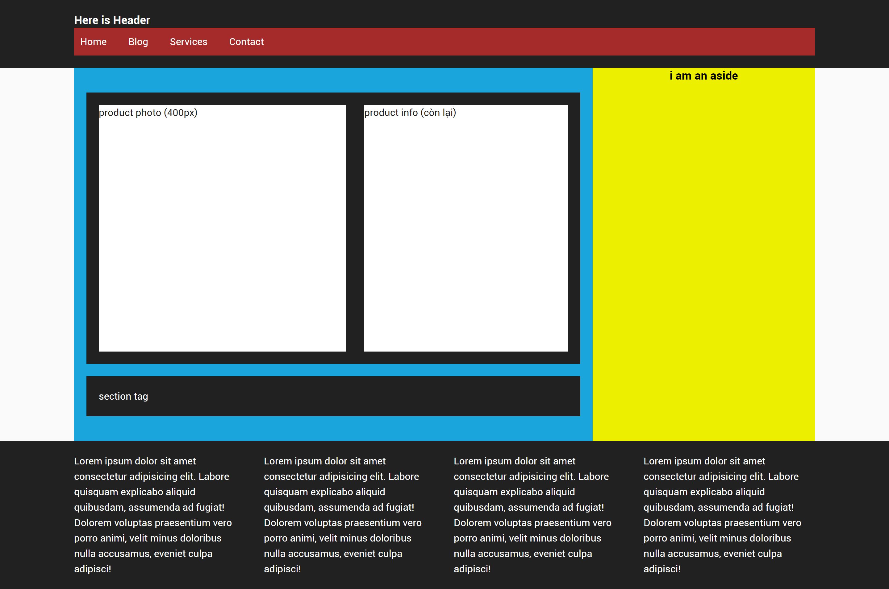

# Workshop Session 7

## Task 1: Tạo một Layout sử dụng cá thẻ Semantic Tag Layout

- header
- nav
- main
- aside
- footer
- article
- section

Có sử dụng container để giới hạn chiều rộng hiển thị nội dung trang web trên màn hình có kích thước lớn.

Layout giống hình sau:

---

## Task 2: Tạo Navigation bar Basic như hình Demo trên

---

## Task 3

Chia footer thành 4 cột bằng nhau, rồi add nội dung `lorem` vào 4 cột đó, khoảng trống giữ mỗi cột là 30px

---

## Task 4

Chia section product thành 2 phần, phần bên trái 400px, khoảng cách trống giữa 2 phần là 30px
