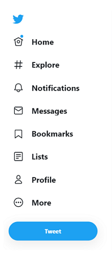

# Ex 2

## Task 1

Sử dụng lại bài tập basic-project ở phần Workshop ở trên mục 03.RoadMap-40h\Day-04-HTML5-T4\3-Workshop-HTML5-L4

Tạo một Vertical Navigation bar như hình demo 

==> Đặt vào phần hiển thị Sidebar của bài tập basic-project trên