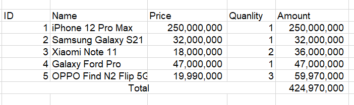

# Bài tập cơ bản

## Bài tập 1: Hàm in lời chào

1. Viết một hàm có tên `sayHello` nhận vào một tham số `name` và in ra câu chào "Hello, [name]!".
2. Gọi hàm `sayHello` với tham số là tên của bạn.


## Bài tập 2: Hàm tính bình phương

1. Viết một hàm có tên `square` nhận vào một tham số `number` và trả về bình phương của số đó.
2. Gọi hàm `square` với giá trị `number` là 4 và in ra kết quả.


## Bài tập 3: Hàm kiểm tra độ dài chuỗi

1. Viết một hàm có tên `isLongString` nhận vào một tham số `str` và trả về `true` nếu độ dài của chuỗi lớn hơn 10, ngược lại trả về `false`.
2. Gọi hàm `isLongString` với giá trị `str` là "Hello, world!" và in ra kết quả.


## Bài tập 4: Hàm tính tổng các phần tử trong mảng

1. Viết một hàm có tên `sumArray` nhận vào một tham số `arr` (mảng các số) và trả về tổng của tất cả các phần tử trong mảng.
2. Gọi hàm `sumArray` với mảng `[1, 2, 3, 4, 5]` và in ra kết quả.


## Bài tập 5: Hàm kiểm tra số nguyên tố

1. Viết một hàm có tên `isPrime` nhận vào một tham số `num` và trả về `true` nếu số đó là số nguyên tố, ngược lại trả về `false`.
2. Gọi hàm `isPrime` với giá trị `num` là 7 và in ra kết quả.


## Task 1

Tạo ra một form có input số lượng mặc định giá trị là 1, input là giá mặc định là 0.

* Một dòng dùng để hiển thị kết quả Thành tiền.
* Một button tăng số lượng.
* một button giảm số lượng.
* Khi tăng giảm số lượng hoặc giá thì Thành tiền tự tính lại.


## Task 2 - Render danh sách

Cho một biến products sản phẩm

```js
 const users = [
  { id: 1, name: 'iPhone 12 Pro Max', price: 250000000, quanlity: 1 },
  { id: 2, name: 'Samsung Galaxy S21', price: 32000000, quanlity: 1 },
  { id: 3, name: 'Xiaomi Note 11', price: 18000000, quanlity: 2 },
  { id: 4, name: 'Galaxy Ford Pro', price: 47000000, quanlity: 1 },
  { id: 5, name: 'OPPO Find N2 Flip 5G', price: 19990000, quanlity: 3 }
];

```

Render giao diện như hình sau:




## Task 3

Cho một đoạn code html như sau:

```html
<ul id="list">
    <li class="child_one">Child 1</li>
    <li class="child_two">
        
    </li>
    <li class="child_three"><a href="link3">Child 3</a></li>
</ul>
```

Yêu cầu:

* 1. Thêm cho thẻ ul một class mới tên `list`
* 2. Lấy nội dung: Child 1 từ thẻ li đầu tiên, hiển thị nội dung lấy được ra console
* 3. Lấy nội dung: thuộc tính `src` và `alt` từ thẻ img, hiển thị ra console
* 4. Thay đổi: thuộc tính `src` và `alt` từ thẻ img bằng một giá trị mới
* 5. Lấy tên class của thẻ li thứ 3, hiển thị ra console

Gợi ý:

* Sử dụng `GetElement Method` và `QuerySelector Methods` của javascript để thực hiện. Tài liệu: <https://www.w3schools.com/jsref/met_document_queryselector.asp>

## Task 4

Cho một đoạn code html như sau:

```html
<input placeholder="username" type="text" name="username" value="" />
<input  placeholder="password" type="text" name="password" value="" />
```

Yêu cầu: 

* Bước 1: Add cho 2 input nói trên 2 giá trị tương ứng vào thuộc tính value
* Bước 2: Add cho 2 input nói trên 2 thuộc tính `id`
* Bước 3: Lấy 2 giá trị vừa add ở bước 1 dựa vào `id` đã thêm ở bước 2, rồi show kết quả ra console

Gợi ý: thực hiện tuần từ từng bước là được
