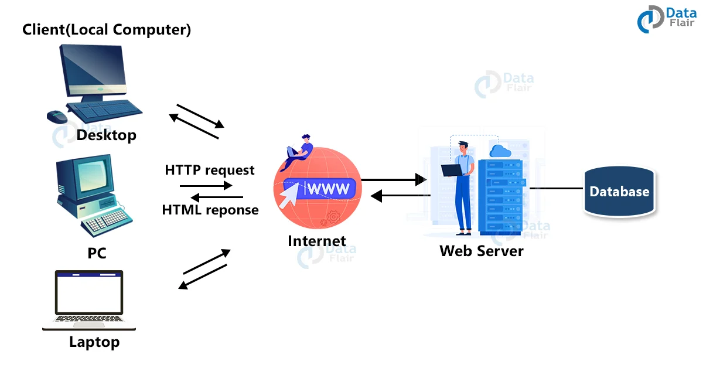

# 01-Introduction-to-the-Web

## ⭐ Web Communication

- Follow: Browser --> Server --> Browser

## ⭐ History HTML

Doc: <https://www.w3schools.com/html/html_intro.asp>
- HTML => HyperText Markup Language
- Author: Tim Berners-Lee
- HTML 1 : 1993 --> HTML 2 : 1995 --> HTML 3 : 1.1997 --> HTML 4: 12.1997 --> 28 - 10 - 2014 ==> HTML 5
- New Features of HTML5:
  - <https://www.w3schools.com/tags/default.asp>
  - The `<canvas>` element is used for 2D drawing
  - New html tags
  - HTML5 has local storage
  - The `<audio>` and `<video>` elements is available for media playback --> instead of Flash
  - Validation form
  - Game HTML5....
  - API ...

## ⭐ Components of a Web Browser

### 1. User Interface
It is an environment allowing users to use certain features like search bar, refresh button, menu, bookmarks, etc.

###  2. Browser Engine
The bridge connects the interface and the engine. It monitors the rendition engine while manipulating the inputs coming from multiple user interfaces.

###  3. Networking
The protocol provides an URL and manages all sorts of safety, privacy and communication.
In addition, the store network traffic gets saved in retrieved documents.

###  4. Data Storage
The cookies store information as the data store is an uniform layer that the browsers use. Storage processes like IndexedDB, WebSQL, localStorage, etc works well on browsers.

###  5. JavaScript Interpreter
It allows conversion of JavaScript code in a document and the executes it. Then the engine shows the translation on the screen to the users.

## ⭐ Static Web Pages ?

A static web page is a web page that is delivered to the user's web browser exactly as stored, in contrast to dynamic web pages which are generated by a web application

## ⭐ Dynamic Web Pages ?

A server-side dynamic web page is a web page whose construction is controlled by an application server processing server-side scripts. In server-side scripting, parameters determine how the assembly of every new web page proceeds, and including the setting up of more client-side processing

## ⭐ Layout of a Page in HTML5

- Use `
` instead of `<table>`
- Basic Layout

## ⭐ What Css ?

Cascading Style Sheets (CSS) is used to format the layout of a webpage.

With CSS, you can control the color, font, the size of text, the spacing between elements, how elements are positioned and laid out, what background images or background colors are to be used, different displays for different devices and screen sizes, and much more!

## ⭐ HTTP Methods ?

Doc: <https://www.w3schools.com/tags/ref_httpmethods.asp>

## ⭐ HTTP Status Messages ?

Doc: <https://www.w3schools.com/tags/ref_httpmessages.asp>

## 1. Elements ?

## 2. Doctype?

Snippet: html:5

## 3. Basic structure html document

html:5

## 4. Data Types (eBooks)

- Text Strings
- URL
- Colors: red
- Lengths: Pixels
- Content Types --> eBooks

## 5. Attributes (eBooks)

- class, id, title, style, src, alt, height, with, data-

## 6. Container and standalone tags

- A container element includes the start tag, contents, sub-elements, and end tag. All the
basic HTML elements are container elements.
- A standalone element consists of the start tag and attributes followed by the end tag as /> without any content

## 7. HTML Block and Inline Elements

- <https://www.w3schools.com/html/html_blocks.asp>

## 8. About FrontEnd Job

- What can you do after this course ?
- Job Market: FrontEnd Developer
