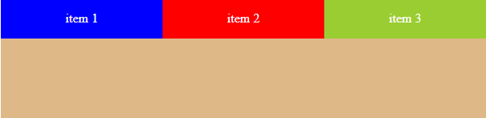
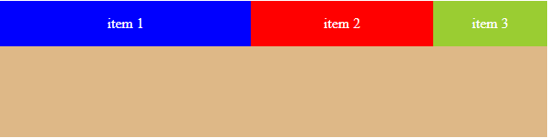
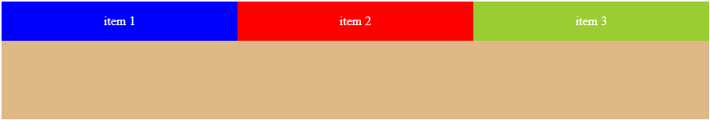
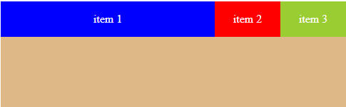

# Understanting-layout-in-Css3

## Css Flex box ?

Flexbox là một kiểu dàn trang (layout mode) mà nó sẽ tự cân đối kích thước của các phần tử bên trong để hiển thị trên mọi thiết bị. Nói theo cách khác, bạn không cần thiết lập kích thước của phần tử, không cần cho nó float, chỉ cần thiết lập nó hiển thị chiều ngang hay chiều dọc, lúc đó các phần tử bên trong có thể hiển thị theo ý muốn.

Dưới đây là sơ đồ cấu trúc Flexbox .


Hai thành phần quan trọng nhất trong một bố cục Flexbox là gồm container và item:

- Container: là thành phần lớn bao quanh các phần tử bên trong, bạn sẽ thiết lập kiểu hiển thị inline (sắp xếp theo chiều ngang) hoặc kiểu sắp xếp theo chiều dọc. Khi đó, các item bên trong sẽ hiển thị dựa trên thiết lập của container này.
- item: Các phần tử con của container được gọi là item, ở item bạn có thể thiết lập nó sẽ sử dụng bao nhiêu cột trong một container, hoặc thiết lập thứ tự hiển thị của nó.


### Css properties with Flex:

- **display**: flex | inline-flex
- **flex-direction**: row (default) | column | row-reverse | column-reverse
- **flex-wrap**: no-wrap (default) | wrap | wrap-reverse
- **flex-basic**: `<length>`
- **justify-content**: flex-start | flex-end | center | space-between | space-around
- **align-items**: flex-start | flex-end | center | baseline | stretch
- **align-content**: flex-start | flex-end | center | baseline | stretch
- **order**: `<number>`
- **flex-grow**: `<number>`
- **flex-shrink**: `<number>`
- **flex**:[flex-grow] [flex-shrink] [flex-basis]
- **flex-flow**: [flex-direction] [flex-wrap];

### Ví dụ

```html
<div class="flex-container">  
   <div class="item item1">item 1</div>  
   <div class="item item2">item 2</div>  
   <div class="item item3">item 3</div>  
</div>
```
Khi set display flex cho class .flex-container được kết quả


### justify-content

Phân phối items theo trục main axis


### align-items

Phân phối items theo trục cross axis


### align-content

Phân phối items theo trục cross axis, Nó chỉ có tác dụng khi có nhiều items trong container.

### order

Sắp xếp vị trí items theo thứ tự mong muốn

### flex-grow

Khi sử dụng flex-grow nó sẽ giúp ta sử dụng khoảng trống còn lại trong một box, hoặc độ rộng của div có flex-grow sẽ tăng lên bao nhiêu phần so với phần còn lại.

Ví dụ 1:

set cho class item1 thuộc tính `flex-grow: 1` và xem kết quả:


Chúng ta sẽ thấy Item 1 sẽ lấp đầy khoảng trống còn lại

Hoặc `flex: 1` chúng ta cũng được kết quả tương tự

Ví dụ 2: Set tất cả các item `flex-grow: 1` và xem kết quả



Như chúng ta thấy tất cả Item có độ rộng như nhau. đó là bởi vì chúng ta đã set cho chúng tỉ lệ như nhau.
 Bạn có thể hiểu flex-container bây giờ chia làm 3 phần, mỗi item chiếm 1 phần


 Ví dụ 3: set như sau

 ```css
.item1 {
  flex-grow: 3;
}
.item2 {
  flex-grow: 1;
}  
.item3 {
  flex-grow: 2;
}
 ```

Kết quả



Như các bạn thấy, mình có tổng cộng 3 Item. Và tổng giá trị của flex-grow sẽ là 3+2+1 = 6. Chúng ta sẽ có Item 1 sẽ chiếm 3/6, Item 2 là 2/6, Item 3 là 1/6. Kết quả ta được như hình trên

### flex-shrink

Shrink dịch ra là "co lại", tên gọi tương ứng với nhiệm vụ, nó sẽ co lại khi chúng ta thay đổi width của parent xuống.

Giá trị mặc định của flex-shrink là 1. Điều này có nghĩa là khi không đủ không gian, các item sẽ co lại theo tỷ lệ mặc định, nhưng không nhỏ hơn content bên trong nó 

```css
.flex-container {
    display: flex;
    height: 150px;
    max-width: 900px;
    background-color: burlywood;
}
.item {
    width: 300px;
    height: 50px;
    color: white;
    display: flex;
    align-items: center;
    justify-content: center;
}
.item1 {
    background-color: blue;
    /* flex-grow: 1; */
    flex-shrink: 0;
}
.item2 {background-color: red;
    /* flex-grow: 1 */
}
.item3 {background: yellowgreen;
    /* flex-grow: 1; */
    
}
```

Nếu đủ chiều rộng thì kết quả



Nếu không đủ chiều rộng thì kết quả



Đối với .item1, thuộc tính flex-shrink được đặt thành 0. Điều này có nghĩa là khi không đủ không gian để hiển thị tất cả các phần tử con, .item1 sẽ không co lại và giữ nguyên kích thước ban đầu của nó.

Đối với .item2, .item3 thuộc tính flex-shrink không được đặt giá trị cụ thể. Mặc định, giá trị của flex-shrink là 1. Điều này có nghĩa là khi không đủ không gian, .item2,3 sẽ co lại theo tỷ lệ mặc định.


Thao khảo minh họa từ các nguồn: 

Guide: <https://css-tricks.com/snippets/css/a-guide-to-flexbox/>

Cheat: <https://flex.eszter.space/>

Demo: <https://codepen.io/enxaneta/full/adLPwv/>

Flexbox Model (xem hình minh họa) -- <https://developer.mozilla.org/en-US/docs/Learn/CSS/CSS_layout/Flexbox#the_flex_model>


## Grid Css ?

Lợi ích của việc sử dụng Grid Layout: tạo bố cục linh hoạt, tương thích trên nhiều thiết bị, dễ dàng tạo các khu vực đa cột và đa hàng, tiết kiệm thời gian và tăng hiệu suất phát triển.

Dùng khi cần chia container thành nhiều phần có bố cục quá phức tạp mà "display: block" hoặc "display: flex" 

**Phần II: Cú pháp và cơ bản (10 phút)**

1. Cú pháp:

   - Giải thích cú pháp sử dụng "display: grid" trên một phần tử cha (container).
   - Cách chọn thành phần con (items) để nằm trong grid container.

1. Thuộc tính của grid container:

   - "grid-template-columns": Định nghĩa kích thước và số lượng cột trong grid.
   - "grid-template-rows": Định nghĩa kích thước và số lượng hàng trong grid.
   - "grid-gap": Tạo khoảng cách giữa các ô trong grid.
   - "grid-template-areas": Xác định vùng của các ô trong grid.

   **Ví dụ:**

   ```css
   .container {
     display: grid;
     grid-template-columns: 1fr 1fr 1fr;
     grid-template-rows: 100px 200px;
     grid-gap: 10px;
   }
   ```

**Phần III: Xây dựng grid layout (15 phút)**

1. Grid lines và grid cells:

   - Giải thích khái niệm grid lines và grid cells.
   - Cách xác định kích thước của các cột và hàng trong grid.

1. Grid tracks:

   - Giới thiệu về khái niệm track (cột hoặc hàng) và cách xác định kích thước của chúng.
   - Sử dụng "fr" (fractional unit) để phân chia không gian tỷ lệ trong grid.

1. Grid items:

   - Sử dụng "grid-column" và "grid-row" để xác định vị trí của các grid items trong grid.
   - Sử dụng "grid-area" để định nghĩa vùng của các grid items.

   **Ví dụ:**

   ```css
   .item {
     grid-column: 1 / 3; /* Grid item chiếm 2 cột */
     grid-row: 1; /* Grid item chiếm 1 hàng */
     /* Hoặc có thể sử dụng grid-area: 1 / 1 / 2 / 3; */
   }
   ```

**Phần IV: Các tính năng bổ sung (10 phút)**

1. Grid template areas:

   - Sử dụng "grid-template-areas" để định nghĩa vùng của các ô trong grid một cách trực quan.

   **Ví dụ:**

   ```css
   .container {
     display: grid;
     grid-template-areas:
       "header header"
       "sidebar main"
       "footer footer";
   }
   ```

1. Grid alignment:

   - Sử dụng các thuộc tính "justify-items", "align-items", "justify-content" và "align-content" để căn chỉnh và phân phối các grid items trong grid.

   **Ví dụ:**

   ```css
   .container {
     justify-items: center; /* Căn giữa theo chiều ngang */
     align-items: center; /* Căn giữa theo chiều dọc */
   }
   ```

**Phần V: Thực hành và ví dụ (15 phút)**

- Hướng dẫn học viên thực hành tạo một grid layout đơn giản bằng cách sử dụng thuộc tính "display: grid".
- Cung cấp ví dụ và hướng dẫn về cách tạo bố cục phức tạp hơn với grid layout.

**Phần VI: Tổng**Phần VI: Tổng kết và câu hỏi (5 phút)\*\*

- Tổng kết lại những điểm quan trọng đã học về thuộc tính "display: grid".
- Mời học viên đặt câu hỏi và tạo không gian thảo luận cuối cùng.

**Ghi chú:** Thời gian mỗi phần có thể điều chỉnh phù hợp để phù hợp với thời lượng bài giảng.

