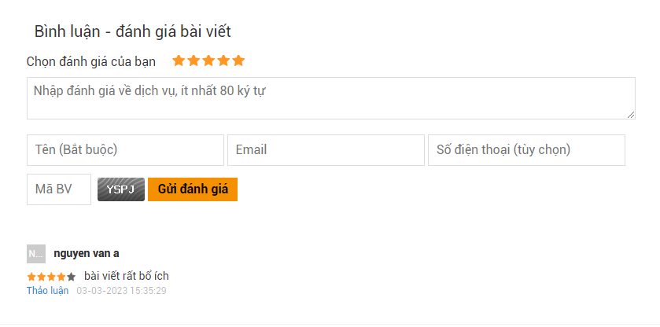

# Workshop

Sử dụng lại bài tập basic-project ở phần Workshop ở trên mục 03.RoadMap-40h\Day-04-HTML5-T4\3-Workshop-HTML5-L4.

Sau khi làm nối tiếp các bài tập Homework vào

## Task 1: 

Tạo một bảng với giao diện như hình dưới đây, để làm bảng thông số  cho sản phẩm.

đặt vào phần Sidebar

## Task 2

Tạo form bình luận như hình dưới đây ==> Đưa form này vào cuối section tag trong basic-project

- Nội dung đánh giá tối thiểu 8 kí tự, yêu cầu nhập
- Tên bắt buộc nhập, tối thiểu 4 kí tự
- Email: bắt buộc nhập và đúng định dạng email
- Số điện thoại tùy chọn
- Mã bảo vệ: bắt buộc nhập, tối thiểu và tối da 4 kí tự.

