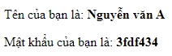

# Bài tập cơ bản

## Task 1

* Sử dụng hàm prompt() để lấy giá trị đầu vào cho 2 biến username, password
* Hiển thị ra màn hình 2 dòng:
  * Tên của bạn là: ?
  * Mật khẩu của bạn là: ?




## Task 2

- Sử dụng HTML tạo ra một button có tên là Delete, sử dụng JavaScript để bắt sự kiện onclick, hiển thị hộp thoại xác nhận với lời nhắn: "Bạn có chắc chắn muốn xóa record này không ?"
- Show kết quả xác nhận ra màn hình console.log


## Task 3

Cho một đoạn code html như sau:

```html
<ul id="list">
    <li class="child_one">Child 1</li>
    <li class="child_two">
        
    </li>
    <li class="child_three"><a href="link3">Child 3</a></li>
</ul>
```

Yêu cầu:

* 1. Thêm cho thẻ ul một class mới tên `list`
* 2. Lấy nội dung: Child 1 từ thẻ li đầu tiên, hiển thị nội dung lấy được ra console
* 3. Lấy nội dung: thuộc tính `src` và `alt` từ thẻ img, hiển thị ra console
* 4. Thay đổi: thuộc tính `src` và `alt` từ thẻ img bằng một giá trị mới
* 5. Lấy tên class của thẻ li thứ 3, hiển thị ra console

Gợi ý:

* Sử dụng `GetElement Method` và Q`uerySelector Methods` của javascript để thực hiện. Tài liệu: <https://www.w3schools.com/jsref/met_document_queryselector.asp>

* Cách 2: Sử dụng thư viện jQuery, để dùng jQuery cần nhúng thêm thư viện jQuery vào. search `jquery cdn`, lấy code chèn trước thẻ body đóng


Tham khảo các ví dụ trong folder Examples


## Task 4

Cho một đoạn code html như sau:

```html
<input placeholder="username" type="text" name="username" value="" />
<input  placeholder="password" type="text" name="password" value="" />
```

Yêu cầu: 

* Bước 1: Add cho 2 input nói trên 2 giá trị tương ứng vào thuộc tính value
* Bước 2: Add cho 2 input nói trên 2 thuộc tính `id`
* Bước 3: Lấy 2 giá trị vừa add ở bước 1 dựa vào `id` đã thêm ở bước 2, rồi show kết quả ra console

Gợi ý: thực hiện tuần từ từng bước là được

Có thể dùng javascript hoặc jquery