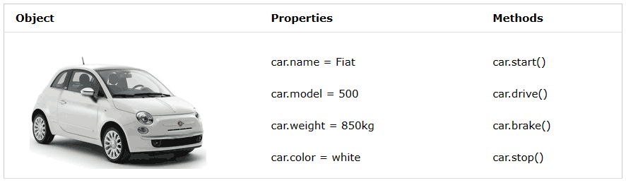

# JavaScript Functions and Objects

## ⭐ 2 Objects

### 2.1 Objects ? 

- Doc: <https://www.w3schools.com/js/js_object_definition.asp>

In real life, a car is an object.

A car has properties like weight and color, and methods like start and stop:



All cars have the same properties, but the property values differ from car to car.

All cars have the same methods, but the methods are performed at different times.

In Javascript:

```js
//Object Car
const car = {type:"Fiat", model:"500", color:"white"};
```

**Object Definition**

https://www.w3schools.com/js/js_object_definition.asp

There are different ways to create new objects:

- Create a single object, using an object literal.

- Create a single object, with the keyword new.

- Define an object constructor, and then create objects of the constructed type.

- Create an object using Object.create().


### 2.1 Accessing Object Properties ? 

```js
objectName.propertyName
objectName["propertyName"]
person.lastName;
objectName.methodName()
```

### 2.2 Object ES6 
- Destructuring Object ES6 => https://www.w3schools.com/react/react_es6_destructuring.asp
- Rest Parameter Object ES6 ==> https://www.w3schools.com/js/js_es6.asp#mark_rest
- Spread Object ES6 => https://www.w3schools.com/react/react_es6_spread.asp


### 2.3 Object Constructors

Doc: <https://www.w3schools.com/js/js_object_constructors.asp>

### 2.4 Object Prototypes

Doc: <https://www.w3schools.com/js/js_object_prototypes.asp>

### 2.5 Date Objects

- <https://www.w3schools.com/js/js_dates.asp>
- <https://www.w3schools.com/js/js_date_methods.asp>
- <https://www.w3schools.com/js/js_date_methods_set.asp>
- Format day with moment

### Polyfill ?

View more: <https://anonystick.com/blog-developer/polyfill-la-gi-cach-trien-khai-mot-polyfill-2021041145634844>

## ⭐ 3. Errors

- Doc : <https://www.w3schools.com/js/js_errors.asp>
- Throw, and Try...Catch...Finally
