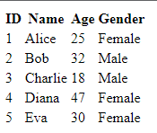

# Bài tập cơ bản

## Task 1

Tạo ra một form có input số lượng mặc định giá trị là 1, input là giá mặc định là 0.

* Một dòng dùng để hiển thị kết quả Thành tiền.
* Một button tăng số lượng.
* một button giảm số lượng.
* Khi tăng giảm số lượng hoặc giá thì Thành tiền tự tính lại.


## Task 2 - Render danh sách

Cho một biến users người dùng

```js
 const users = [
  { id: 1, name: 'Alice', age: 25, gender: 'Female' },
  { id: 2, name: 'Bob', age: 32, gender: 'Male' },
  { id: 3, name: 'Charlie', age: 18, gender: 'Male' },
  { id: 4, name: 'Diana', age: 47, gender: 'Female' },
  { id: 5, name: 'Eva', age: 30, gender: 'Female' }
];

```

Render giao diện như hình sau:



