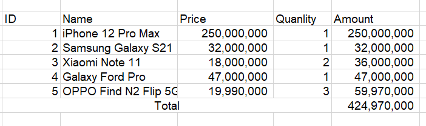

# Bài tập cơ bản

## Task 1

Tạo ra một form có input số lượng mặc định giá trị là 1, input là giá mặc định là 0.

* Một dòng dùng để hiển thị kết quả Thành tiền.
* Một button tăng số lượng.
* một button giảm số lượng.
* Khi tăng giảm số lượng hoặc giá thì Thành tiền tự tính lại.


## Task 2 - Render danh sách

Cho một biến products sản phẩm

```js
 const users = [
  { id: 1, name: 'iPhone 12 Pro Max', price: 250000000, quanlity: 1 },
  { id: 2, name: 'Samsung Galaxy S21', price: 32000000, quanlity: 1 },
  { id: 3, name: 'Xiaomi Note 11', price: 18000000, quanlity: 2 },
  { id: 4, name: 'Galaxy Ford Pro', price: 47000000, quanlity: 1 },
  { id: 5, name: 'OPPO Find N2 Flip 5G', price: 19990000, quanlity: 3 }
];

```

Render giao diện như hình sau:



