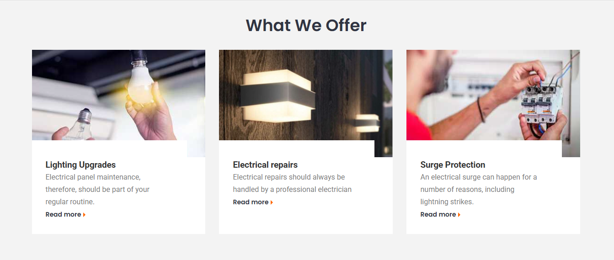

# Bài TEST review Day 01 - 04

## Task 1 - Review lý thuyết

Cho một đoạn code HTML như sau:

```html
<ul>
    <li>Help & FAQs</li>
    <li>Order Tracking</li>
    <li>Shipping & Delivery</li>
    <li>Orders History</li>
    <li>Advanced Search</li>
    <li>Corporate Sales</li>
    <li>Privacy</li>
</ul>
```

Thực hiện yêu cầu sau:

1. Tô  màu thẻ li đầu tiên thành màu đỏ (red)
2. Biến đổi chữ ở thẻ li thứ 2 thành viết HOA và in nghiêng bằng Css.
3. Tạo liên kết cho từ `Shipping` trong thẻ li thứ 3 sau đó định dạng bằng link đó cho đẹp mặc định màu đen, hover lên màu đỏ, bỏ phần gạch chân.
4. Định dạng thẻ li cuối cùng thành in đậm.
5. Tạo khoảng cách giữa các thẻ li khoảng `10px` để nhìn thoáng hơn.
6. Bỏ phần kí tự đầu dòng của thẻ ul nói trên.


## Task 2 - Thực hành code UI

Code UI giống như hình minh hoạ sau:



Hình ảnh có thể vào trang https://unsplash.com/ và search với từ khoá `electric`. Sau đó sử dụng hình trong danh sách khớp tỉ lệ 4:3 tải về lưu vào project để chèn vào.

Cho biết 
- font chữ mặc định là `Poppins` từ google Font
- container với chiều rộng `1200px`