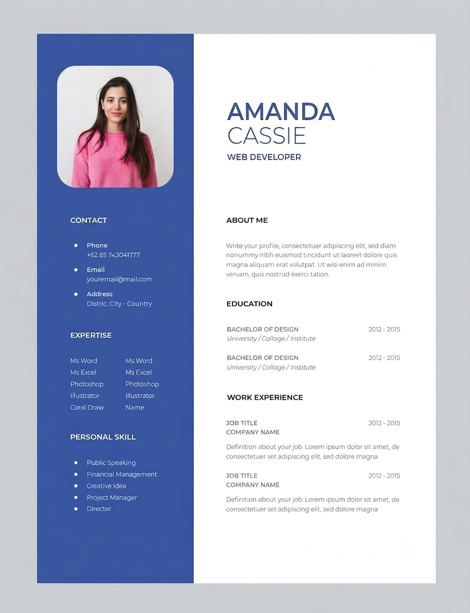

# Bài test kết thúc môn HTML, CSS, JS

## UI Mẫu



## Yêu cầu

Code một giao diện CV giống như UI mẫu ở trên.

- Nội dung không bắt buộc phải giống trong UI mẫu, có thể lấy thông tin của chính bạn
- Font size mặc định `16px`, font chữ `Montserrat` cho tiêu đề chính và `Open Sans` cho nội dung.
- Tone màu chính: tuỳ sở thích màu của bạn. Trong ví dụ là: `#3958A8`
- Màu nền `#f3f3f3`
- Avatar: Có thể lấy hình của bạn hoặc tìm ở `https://unsplash.com/` với từ khoá `female avatar`
- Chiều rộng container `1200px`


## Cấu trúc dự án yêu cầu

```
test-final-yourName
    ├── index.html
    └── css
        └── style.css
    └── img
        └── avatar.jpg
```

## Link nộp

### Phương án 1: Deploy lên Github Page (Ưu tiên)

- Tạo một repo mới, đồng bộ code lên
- Deploy lên github page
- Gửi link repo về email `nhannn@softech.vn`
- Cộng 2 điểm (nếu chưa đạt điểm tối đa  khi nộp theo hình thức này)

### Phương án 2: Link Driver

**Kéo hết folder cấu trúc dự án trên** --> Thả vào driver link sau: https://drive.google.com/drive/folders/1Wxx8uqP2GFTG2Qhh2DHp1jGEgs1m6t7B?usp=sharing

Nộp không đủ cấu trúc bị trừ 3 điểm.

