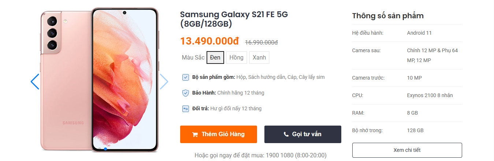

# Bài tập tổng hợp đánh giá HTML CSS

## Yêu cầu

Áp dụng toàn bộ kiến thức HTML, CSS đã học để tạo ra một UI hiển thị sản phẩm như hình minh hoạ.



## Cho biết

- Tên sản phẩm là h1, size 22px
- Hình sản phẩm: 'samsung-galaxy-s21.jpg' bên trên. Size hiển thị `400x400px`
- Màu chính: `#ff6700`
- Màu phụ: `#303442`
- Font: `Arial`
- Icons: sử dụng svg từ [Lucie React](https://lucide.dev/icons/)

## Cấu trúc file mong muốn

```
review-your-name
    ├── index.html
    ├── css
        └── style.css
    ├── img
        └── samsung-galaxy-s21.jpg
```

## Link nộp

Thả vào driver link sau: https://drive.google.com/drive/folders/15RtT1fROsyL7pjIP7v7mioz8WlaaKVei?usp=drive_link