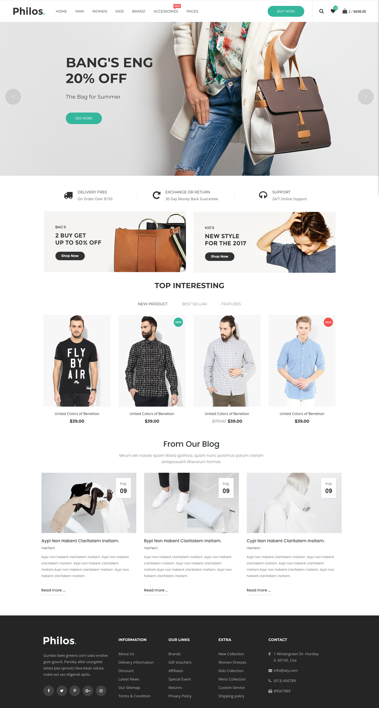

# Bài Kết thúc môn

Hạn 3/6 nộp bài.
Tạo folder Day-15 làm bài trong đó rồi push lên github
Inbox riêng link git cho giáo viên

## Công nghệ

Bất kỳ làm sao mà ra được sản phẩm như hình.

## Yêu cầu Chung

* Font chữ: Montserrat (Lấy từ Google Font)
* Màu chữ: mặc định #333
* Các liên kết hover lên thì đổi màu: #34b79d
* Có làm responsive trên tablet + mobile

## Ảnh Slide Lớn

- http://theme.nileforest.com/html/philos/img/slide-img/slide_bg1.jpg
- https://theme.nileforest.com/html/philos/img/slide-img/slide_bg2.jpg
- https://theme.nileforest.com/html/philos/img/slide-img/slide_bg3.jpg

Sử dụng Owl-carousel hoặc swiperjs

SLide có phần nội dung chữ nằm trên hình như Demo

## Ảnh Khác

Bạn có thể sử dụng công cụ Snipping tool để cắt ra từ hình screen shot đề bài

